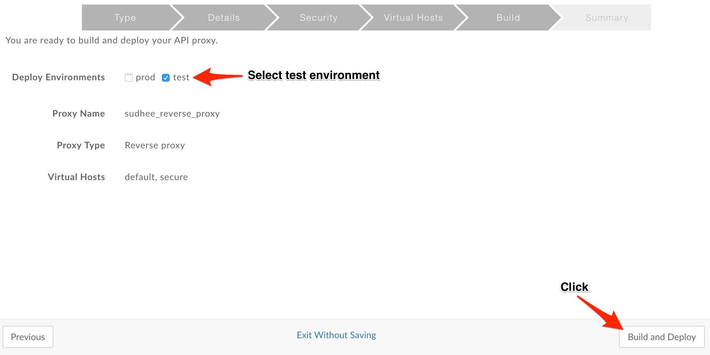

# API Development : Create a Reverse Proxy 

*Duration : 15 mins*

*Persona : API Team*

# Use case

You have a requirement to create a reverse proxy for taking requests from the Internet and forward them to an existing service. The reverse proxy should hide the complexity and interface details of the underlying service. Also Clients (mobile apps, Web apps etc.) making requests to the proxy may not be aware of the internal network and service.

# How can Apigee Edge help?

Apigee Edge enables you to quickly expose backend services as APIs. You do this by creating an API proxy that provides a facade for the backend service that you want to expose. You only need to provide the network address for the backend service, along with some information that Edge uses to create the API proxy that is exposed to developers. 

The API proxy decouples your backend service implementation from the API that developers consume. This shields developers from future changes to your backend services. As you update backend services, developers, insulated from those changes, can continue to call the API uninterrupted.

In this lab we will see how to create a reverse proxy, that routes inbound requests to existing HTTP backend services. 

# Pre-requisites

A web browser (we suggest Google Chrome), and an internet connection. 

# Instructions

* Go to [https://apigee.com/edge](https://apigee.com/edge) and log in. This is the Edge management UI. 

* Select **Develop →API Proxies** in the side navigation menu

  

* Click **+ Proxy**. The Build a Proxy wizard is invoked.

  

* Select **Reverse proxy**. Click on **Next**.

  

* Enter details in the proxy wizard. Replace **{your-initials}** with the initials of your name. 

  * Proxy Name: **{your_initials}**_reverse_proxy

  * Proxy Base Path: /v1/**{your_initials}**_reverse_proxy

  * Existing API: [http://apigeedemovideos-test.apigee.net/employees-api](http://apigeedemovideos-test.apigee.net/employees-api) 

  

* Verify the values and click **Next**.

* Select **Pass through (none)** for the authorization in order to choose not to apply any security policy for the proxy. Click **Next**. 
  
  

* Go with the **default Virtual Host** configuration.

  

* Ensure that only the **test** environment is selected to deploy to and click **Build and Deploy.** 

  

  Apigee Edge will build and deploy an API Proxy. 
  
* Once the API proxy has been built and deployed **click** the link to view your proxy in the proxy editor. 

  

* You should see the proxy **Overview** screen. You should familiarize yourself with the controls available here. Some highlights are shown in this screenshot.  

  

* *Congratulations!*...You have now built a reverse proxy for an existing backend service.

* Let us test the newly built API proxy using the [Apigee REST Client](https://apigee-rest-client.appspot.com/).  The Apigee REST Client is a web application that can invoke HTTP APIs.  Right-click the link to open the REST Client in a new browser window.

* Copy the URL for your API proxy. 

  

* Now, switch to the tab containing the Apigee REST Client.  Paste the link into the form field on that web page, and **click** SEND. This will send a GET request.

  

* In the page for the Apigee REST client, you should see a success response similar to this:

  

# Export the API Proxy

* Let’s now download the API Proxy definition, so that we can use it in other labs.

* Flip back to the Apigee.com tab. Click Project...Download revision. 

# Lab Video

If you like to learn by watching, here is a short video on creating a reverse proxy in Apigee Edge [https://www.youtube.com/watch?v=ZtINy7n9QRc](https://www.youtube.com/watch?v=ZtINy7n9QRc) 

# Earn Extra-points

Now that you have created a reverse proxy, apply traffic management policies to protect the API proxy and then save it as a new revision. Then deploy the new revision to Test environment. 

# Quiz

1. How to download (backup) the proxy you just created? 

2. Can "wildcards" be used in the API proxy base path?

# Summary

That completes this hands-on lesson. In this simple lab you learned how to create a proxy for an existing backend using Apigee Edge proxy wizard.

# References

* Useful Apigee documentation links on API Proxies - 

    * Build a simple API Proxy - [http://docs.apigee.com/api-services/content/build-simple-api-proxy](http://docs.apigee.com/api-services/content/build-simple-api-proxy) 

    * Best practices for API proxy design and development - [http://docs.apigee.com/api-services/content/best-practices-api-proxy-design-and-development](http://docs.apigee.com/api-services/content/best-practices-api-proxy-design-and-development) 

* Watch this 4minute video on "Anatomy of an API proxy" - [https://youtu.be/O5DJuCXXIRg](https://youtu.be/O5DJuCXXIRg) 

# Rate this lab

How did you like this lab? Rate [here](https://goo.gl/forms/ZuI2obFmWIhV0Bym1).

