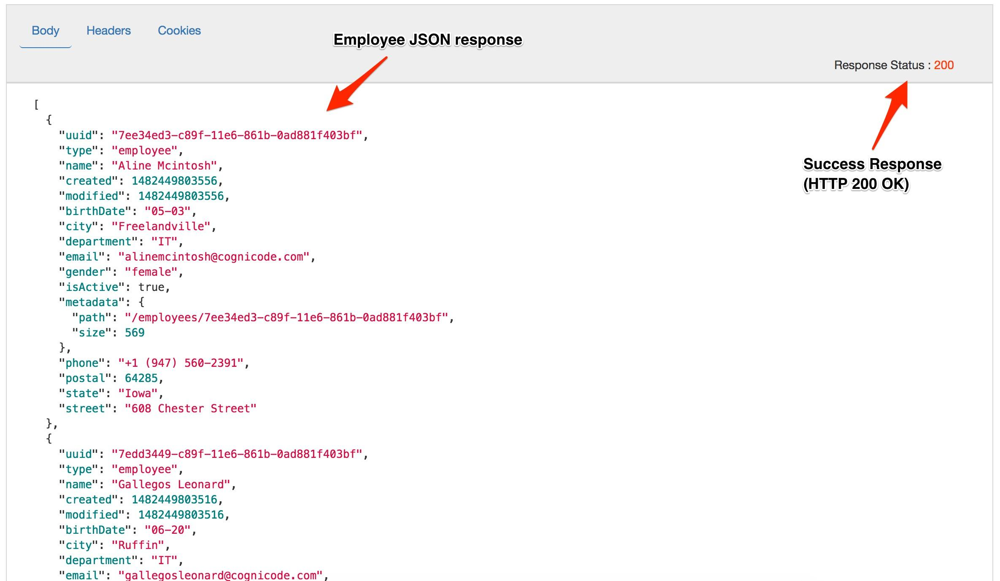

# API Development : Create a Reverse Proxy 

*Duration : 15 mins*

*Persona : API Team*

# Use case

You have a requirement to create a reverse proxy for taking requests from the Internet and forward them to an existing service. The reverse proxy should hide the complexity and interface details of the underlying service. Also Clients (mobile apps, Web apps etc.) making requests to the proxy may not be aware of the internal network and service.

# How can Apigee Edge help?

Apigee Edge enables you to quickly expose backend services as APIs. You do this by creating an API proxy that provides a facade for the backend service that you want to expose. You only need to provide the network address for the backend service, along with some information that Edge uses to create the API proxy that is exposed to developers. 

The API proxy decouples your backend service implementation from the API that developers consume. This shields developers from future changes to your backend services. As you update backend services, developers, insulated from those changes, can continue to call the API uninterrupted.

In this lab we will see how to create a reverse proxy, that routes inbound requests to existing HTTP backend services. 

# Pre-requisites

A web browser (we suggest Google Chrome), and an internet connection. 

# Instructions

1. Go to [https://apigee.com/edge](https://apigee.com/edge) and log in. This is the Edge management UI. 

2. Select **Develop →API Proxies** in the side navigation menu

   

3. Click **+ Proxy**. The Build a Proxy wizard is invoked.

   

4. Select **Reverse proxy**. Click on **Next**.

   

5. Enter details in the proxy wizard. Replace **{your-initials}** with the initials of your name. 

   * Proxy Name: **{your_initials}**_reverse_proxy
   * Proxy Base Path: /v1/**{your_initials}**_reverse_proxy
   * Existing API: [http://apigeedemovideos-test.apigee.net/employees-api](http://apigeedemovideos-test.apigee.net/employees-api) 

   

6. Verify the values and click **Next**.

7. Select **Pass through (none)** for the authorization in order to choose not to apply any security policy for the proxy. Click **Next**. 
  
   

8. Go with the **default Virtual Host** configuration.

   

9. Ensure that only the **test** environment is selected to deploy to and click **Build and Deploy.** 

   

   Apigee Edge will build and deploy an API Proxy. 
  
9. Once the API proxy has been built and deployed **click** the link to view your proxy in the proxy editor. 

   

9. You should see the proxy **Overview** screen. You should familiarize
   yourself with the controls available here. Some highlights are shown in
   this screenshot.

   

9. *Congratulations!*...You have now built a reverse proxy for an
   existing backend service. This wizard experience gives you a simple
   "pass-through" proxy. The proxy changes nothing in the request,
   before invoking the backend (also known as "target") service. We'll
   get to more complicated scenarios later on.

9. For now, let's test the newly built API proxy using the [Apigee REST
   Client](https://apigee-rest-client.appspot.com/).  The Apigee REST
   Client is a web application that can invoke HTTP APIs.  Right-click
   the link to open the REST Client in a new browser window.

9. Copy the URL for your API proxy. 

   

9. Now, switch to the tab containing the Apigee REST Client.  Paste the
   link into the form field on that web page, and **click** SEND. This will
   send a GET request.

   

9. In the page for the Apigee REST client, you should see a success response similar to this:

   

9. OK, now let's test deployment and undeployment.  Flip back to the browser tab with Apigee Edge.  Undeploy the API Proxy.

   

   You should see a confirmation that the proxy is undeployed.

9. Now, switch again to the tab containing the Apigee REST Client. Invoke the request again. (Send the GET request)

   You should see a 400 response.  
  
   

   If you flip back to the Apigee tab and deploy the proxy again, then
   try again to send a GET request, you should see a successful response
   again.

   When you "deploy" a proxy in Apigee Edge, you are telling Apigee Edge
   to make it available for inbound requests. A proxy that is not
   deployed will not handle requests.

  
# Export the API Proxy

Let’s now download the API Proxy definition, so that we can use it in other labs.

1. Flip back to the Apigee.com tab. Click Project...Download revision. 

   

   This will save a file in ZIP format on your machine. The zip has a
   name like `dpc_reverse_proxy_rev1_2017_03_30.zip`, with your initials
   and today's date appearing in the appropriate places. And the format
   of the file is like so:

   ```
     Length      Date    Time    Name
   ---------  ---------- -----   ----
         808  03-30-2017 21:58   apiproxy/dpc_reverse_proxy.xml
         474  03-30-2017 21:58   apiproxy/targets/default.xml
         630  03-30-2017 21:58   apiproxy/proxies/default.xml
   ---------                     -------
        1912                     3 files

   ```

   All of these files are XML text files. These files can be extracted
   from the ZIP and checked into a source code management system. Later,
   we'll see how to do the converse: import a bundle of files as a new
   proxy, or new revision of a proxy.

   This is a relatively simple proxy; all it does is "pass through"
   requests, and it requires just 3 configuration files for that
   purpose. As we work on more complex scenarios, we'll see that any
   downloaded bundle will include the Apigee Edge policies and resource
   files (nodejs code, XSLT scripts, Java JARs, and so on) for the
   proxy. Proxies can become pretty elaborate!

  
# Lab Video

If you like to learn by watching, here is a short video on creating a reverse proxy in Apigee Edge [https://www.youtube.com/watch?v=ZtINy7n9QRc](https://www.youtube.com/watch?v=ZtINy7n9QRc) 


# For Consideration and Discussion

1. Can "wildcards" be used in the base path for an API proxy?

2. Can you _import_ an API proxy bundle from the Apigee UI?  How? 

3. If the API Proxy is a simple pass-through, and it doesn't change anything in the request, _why did we create it_? What good is it? 

4. What would happen if you tried to deploy 2 proxies to the same base path?


# Summary

That completes this hands-on lesson. In this simple lab you learned :

* how to create a pass-through proxy for an existing HTTP backend using the Apigee Edge proxy wizard.
* how to change the deployment status of an API proxy in Apigee Edge.
* how to export the proxy definition into a proxy bundle ZIP. 


# References

* Useful Apigee documentation links on API Proxies - 

    * [Build a simple API Proxy](http://docs.apigee.com/api-services/content/build-simple-api-proxy) 

    * [Best practices for API proxy design and development](http://docs.apigee.com/api-services/content/best-practices-api-proxy-design-and-development) 

* Watch this 4 minute video on [Anatomy of an API proxy](https://youtu.be/O5DJuCXXIRg) 

# Rate this lab

How did you like this lab? Rate [here](https://goo.gl/forms/ZuI2obFmWIhV0Bym1).

