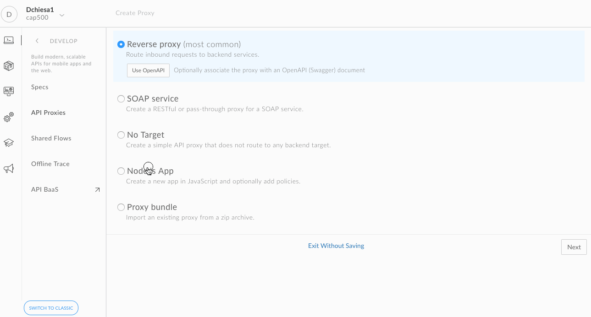
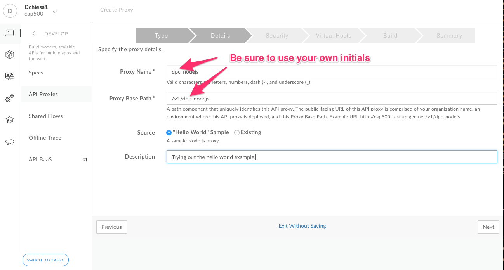
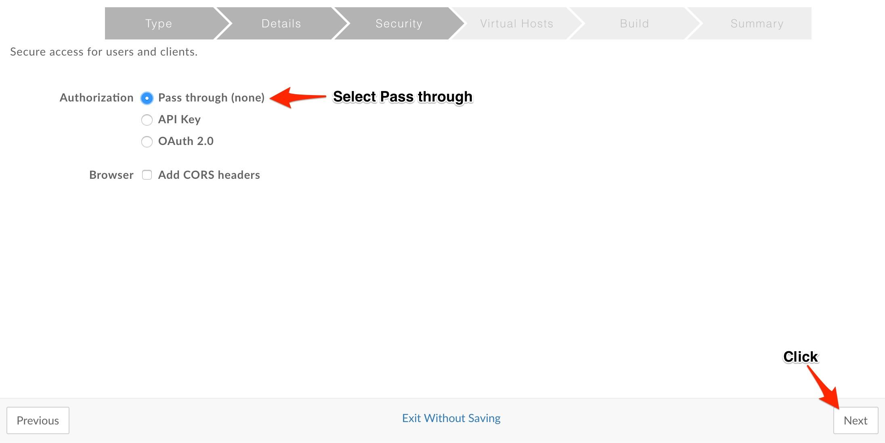
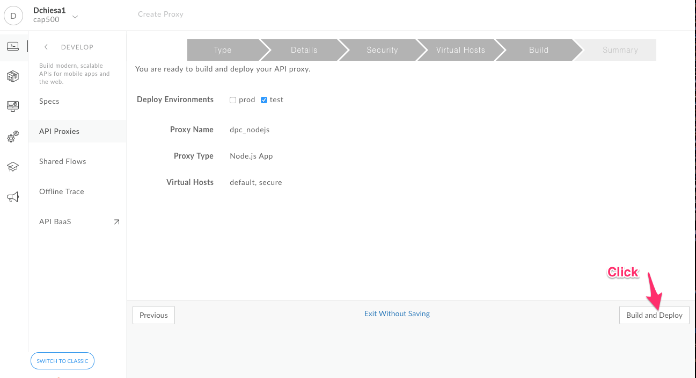

# API Development : Create a Reverse Proxy with a Nodejs Target

*Duration : 15 mins*

*Persona : API Team*

# Use case

Many existing services have an HTTP interface. REST and SOAP services are good examples here.

However, some systems are not easily accessible via HTTP, though they may be accessible from a program, such as a nodejs program, that relies on a library. Examples of such systems are:

* traditional databases, NoSQL databases
* LDAP stores
* message queues
* FTP servers
* AWS Lambda functions

In cases where the "target" system does not expose an HTTP interface, you cannot simply define a traditional reverse proxy in Apigee Edge. You need to write some connecting logic.  

# How can Apigee Edge help?

Apigee Edge enables you to write code to produce an API facade for the non-HTTP backend service that you want to expose. 

In this lab we will see how to create a reverse proxy, that routes inbound requests to an existing service, via a nodejs intermediary layer.

# Pre-requisites

A web browser (we suggest Google Chrome), and an internet connection. 

# Instructions

* Go to [https://apigee.com/edge](https://apigee.com/edge) and log in. This is the Edge management UI. 

* Select **Develop →API Proxies** in the side navigation menu

  

* Click **+ Proxy**. The Build a Proxy wizard is invoked.

  

* Select **Node.js App**. Click on **Next**.

  

* Enter details in the proxy wizard. Replace **{your-initials}** with the initials of your name. 

  * Proxy Name: **{your_initials}**_nodejs

  * Proxy Base Path: /v1/**{your_initials}**_nodejs

  * Source: "Hello World" Sample

  

* Verify the values and click **Next**.

* Select **Pass through (none)** for the authorization in order to choose not to apply any security policy for the proxy. Click **Next**. 
  
  

* Go with the **default Virtual Host** configuration.

  

* Ensure that only the **test** environment is selected to deploy to and click **Build and Deploy.** 

  

  Apigee Edge will build and deploy the API Proxy. 

* XXX Continue here....

* Once the API proxy has been built and deployed **click** the link to view your proxy in the proxy editor. 

  

* You should see the proxy **Overview** screen. You should familiarize yourself with the controls available here. Some highlights are shown in this screenshot.  

  

* *Congratulations!*...You have now built a reverse proxy for an existing backend service.

* Let us test the newly built API proxy using the [Apigee REST Client](https://apigee-rest-client.appspot.com/).  The Apigee REST Client is a web application that can invoke HTTP APIs.  Right-click the link to open the REST Client in a new browser window.

* Copy the URL for your API proxy. 

  

* Now, switch to the tab containing the Apigee REST Client.  Paste the link into the form field on that web page, and **click** SEND. This will send a GET request.

  

* In the page for the Apigee REST client, you should see a success response similar to this:

  

# Export the API Proxy

* Let’s now download the API Proxy definition, so that we can use it in other labs.

* Flip back to the Apigee.com tab. Click Project...Download revision. 


  This will save a file in ZIP format on your machine. The zip has a name like `dpc_reverse_proxy_rev1_2017_03_30.zip`, with your initials and today's date appearing in the appropriate places. And the  format of the file is like so:

```
  Length      Date    Time    Name
---------  ---------- -----   ----
      808  03-30-2017 21:58   apiproxy/dpc_reverse_proxy.xml
      474  03-30-2017 21:58   apiproxy/targets/default.xml
      630  03-30-2017 21:58   apiproxy/proxies/default.xml
---------                     -------
     1912                     3 files

```

All of these files are XML text files. These files can be extracted from the ZIP and checked into a source code management system. Later, we'll see how to do the converse: import a bundle of files as a new proxy, or new revision of a proxy. 

This is a relatively simple proxy; all it does is "pass through" requests, and it requires just 3 configuration files for that purpose. As we work on more complex scenarios, we'll see that any downloaded bundle will include the Apigee Edge policies and resource files (nodejs code, XSLT scripts, Java JARs, and so on) for the proxy. Proxies can become pretty elaborate! 

  
# Lab Video

If you like to learn by watching, here is a short video on creating a reverse proxy in Apigee Edge [https://www.youtube.com/watch?v=ZtINy7n9QRc](https://www.youtube.com/watch?v=ZtINy7n9QRc) 

# For Extra Credit

Now that you have created a reverse proxy, apply traffic management policies to protect the API proxy and then save it as a new revision. Then deploy the new revision to Test environment. 

# Quiz

1. Can "wildcards" be used in the API proxy base path?

2. Can you "import" an API proxy bundle from the Apigee UI?  How? 


# Summary

That completes this hands-on lesson. In this simple lab you learned how to create a proxy for an existing backend using Apigee Edge proxy wizard.

# References

* Useful Apigee documentation links on API Proxies - 

    * Build a simple API Proxy - [http://docs.apigee.com/api-services/content/build-simple-api-proxy](http://docs.apigee.com/api-services/content/build-simple-api-proxy) 

    * Best practices for API proxy design and development - [http://docs.apigee.com/api-services/content/best-practices-api-proxy-design-and-development](http://docs.apigee.com/api-services/content/best-practices-api-proxy-design-and-development) 

* Watch this 4minute video on "Anatomy of an API proxy" - [https://youtu.be/O5DJuCXXIRg](https://youtu.be/O5DJuCXXIRg) 

# Rate this lab

How did you like this lab? Rate [here](https://goo.gl/forms/ZuI2obFmWIhV0Bym1).

