# API Development : Create a Reverse Proxy with a Nodejs Target

*Duration : 15 mins*

*Persona : API Team*

# Use case

Many existing services have an HTTP interface. REST and SOAP services are good examples here.

However, some systems are not easily accessible via HTTP, though they may be accessible from a program, such as a nodejs program, that relies on a library. Examples of such systems are:

* traditional databases, NoSQL databases
* LDAP stores
* message queues
* FTP servers
* AWS Lambda functions

In cases where the "target" system does not expose an HTTP interface, you cannot simply define a traditional reverse proxy in Apigee Edge. You need to write some connecting logic.  

# How can Apigee Edge help?

Apigee Edge enables you to write code to produce an API facade for the non-HTTP backend service that you want to expose. 

In this lab we will see how to create a reverse proxy, that routes inbound requests to an existing service, via a nodejs intermediary layer.

# Pre-requisites

A web browser (we suggest Google Chrome), and an internet connection. 

# Instructions

* First, download [this zip file](./code/intro-nodejs-proxy-20170330.zip) to your local machine, by clicking the link, and then clicking "Download". Then return here.

* In a separate browser tab, navigate to [https://apigee.com/edge](https://apigee.com/edge) and be sure you are logged in.

* Select **Develop →API Proxies** in the side navigation menu

  

* Click **+ Proxy**. The Build a Proxy wizard is invoked.

  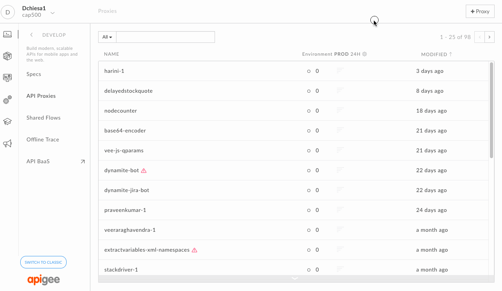

* Select **Proxy bundle**. Click on **Next**, and then choose the zip file that you just downloaded.

  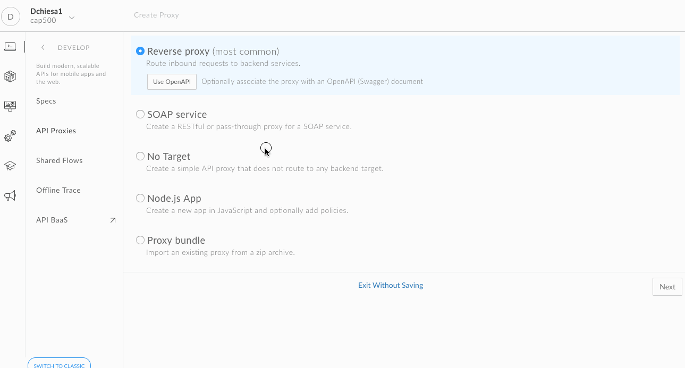

* Specify the name for the new proxy, using your initials..., and click **Next**

  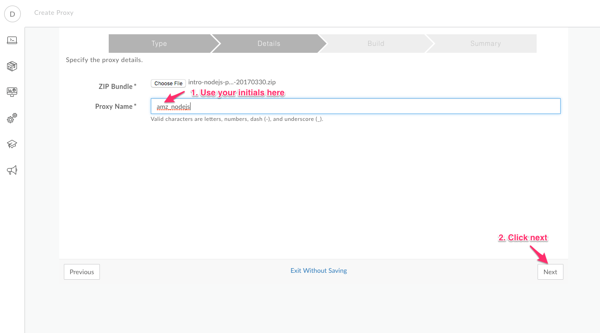

* then click **Build**

  

* Once the API proxy has been built, **click** the link to view your proxy in the proxy editor. 

  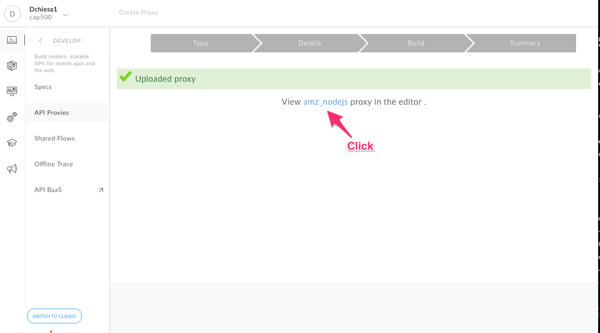

* You should see the proxy **Overview** screen. 

* Click the **Develop** tab.

  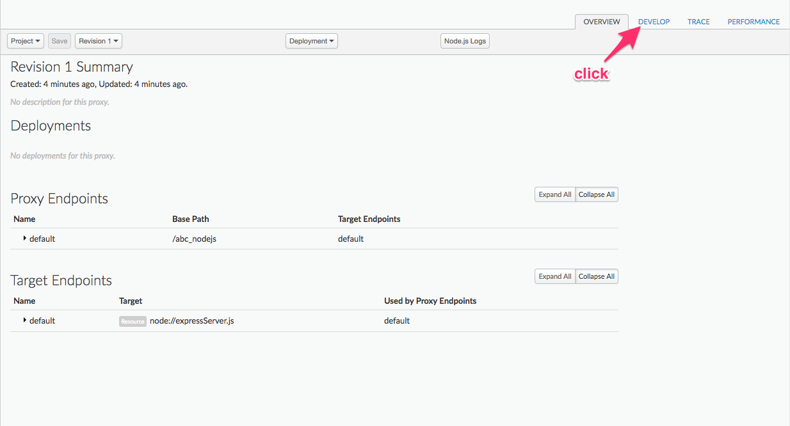

  This shows you the contents of the API Proxy definition.  

* On the lower left-hand side you can see
  the nodejs script that is included in this Proxy. Click the **expressServer.js**

  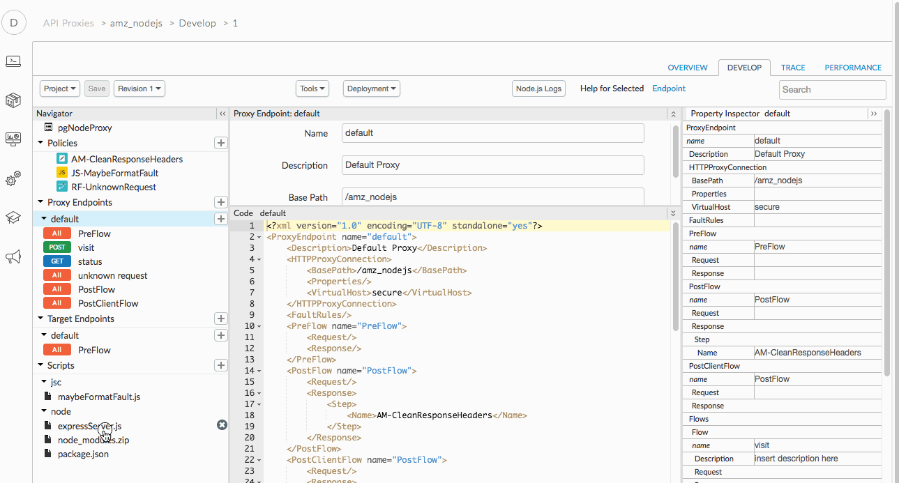

  At this point you can view the nodejs code that is connecting to a Postgres server available
  on the internet. 

* Making sure the left-hand navigator pane is expanded, click the default target.

  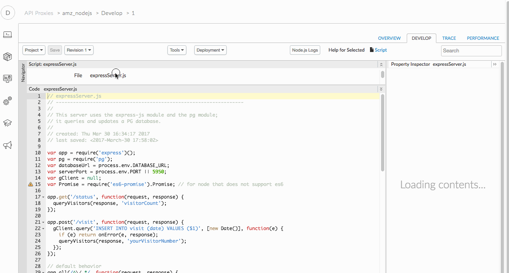

  This is where you can set environment variables used by the nodejs server code.
  In this example, we set the Postgres database URL. 

* The imported proxy is not yet deployed. We must change the
  base path in order to deploy it.  The basepath is encoded in the proxy configuration we just imported, which
  means it is the same for everyone. Let's change it to something unique for each user.  

* On the left-hand-side, select the "default" Proxy endpoint. Then update the Base Path. And click **Save**. 

  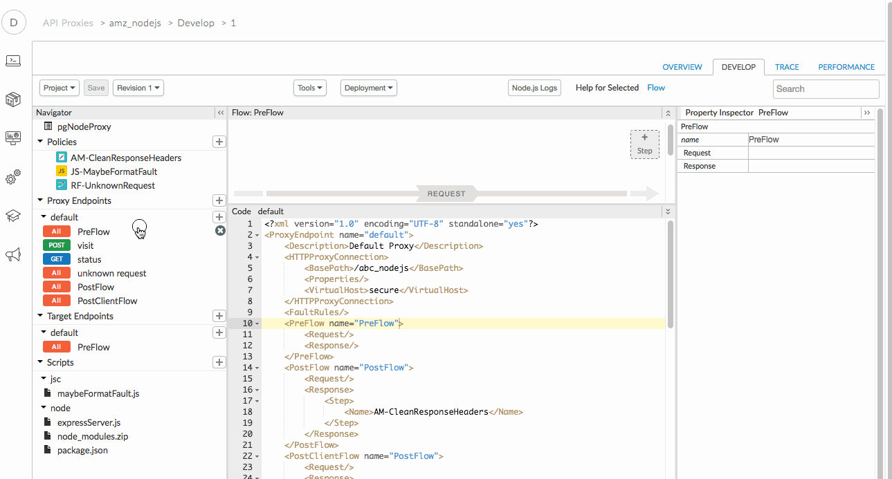

* Deploy the Proxy to the "test" environment. 

  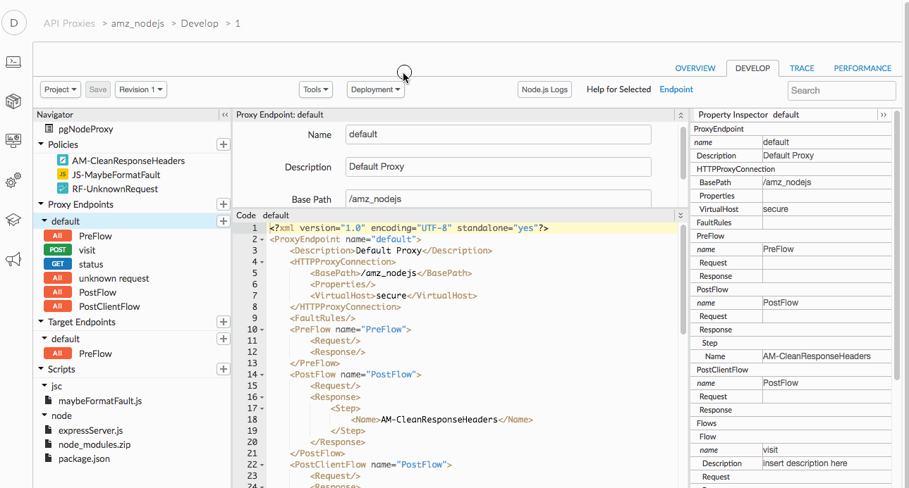

* *Congratulations!*...You have now imported and deployed a proxy for a non-HTTP service.

* Let us test the newly built API proxy. First, let's copy the URL for this proxy.  Click the **Overview** tab and copy the URL. 

  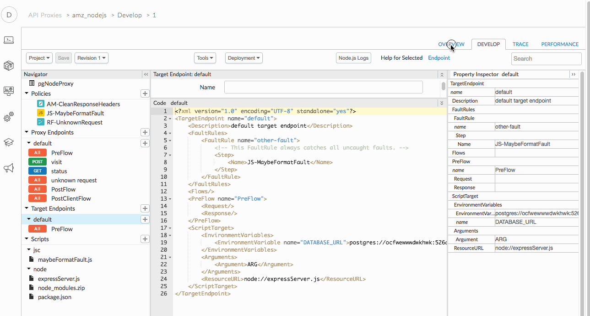

* Now, open a new tab with the [Apigee REST Client](https://apigee-rest-client.appspot.com/), or switch to an existing browser tab that has the Apigee REST Client open. 

* Paste the link into the form field on that web page.  Append to the URL a /status.  Like so:

  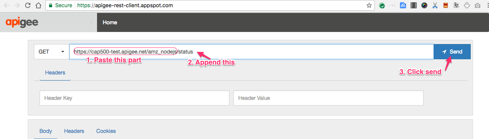

* **Click** SEND. This will send a GET request.

* In the page for the Apigee REST client, you should see a success response similar to this:

  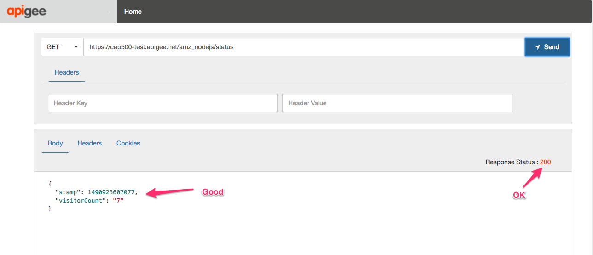

* Now, replace /status with /visit, select the POST verb, and click Send. Like so:

  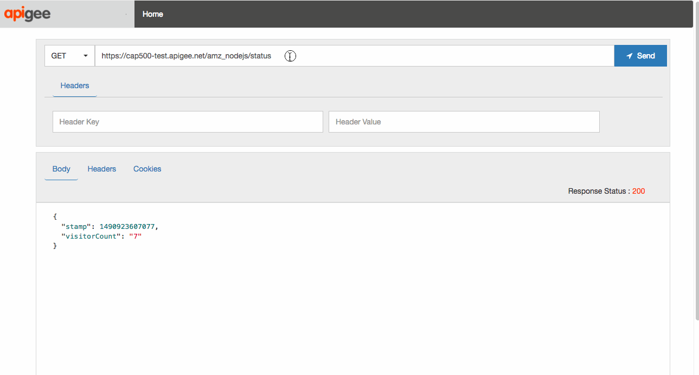

* This will run different logic in the nodejs server, which updates Postgres. 

# For Extra Credit

Can you replace the nodejs logic with code that connects to a different networked system? 

# For Discussion and Consideration

1. Can a proxy use multiple targets? For example, both Nodejs and HTTP backends?  Can you think of a case where this would be necessary?

2. When is it appropriate to embed nodejs code in Apigee Edge, versus hosting it independently on a public cloud? 

# Summary

That completes this hands-on lesson. In this simple lab you learned:

* how to import an proxy
* how Apigee Edge can run nodejs logic to handle inbound requests

# References

* Useful Apigee documentation links

    * [Overview of Node.js on Apigee Edge](http://docs.apigee.com/api-services/content/overview-nodejs-apigee-edge)

* Watch this one hour [Webinar on Node.js in Apigee Edge](https://youtu.be/u8nkdaURFrU)

