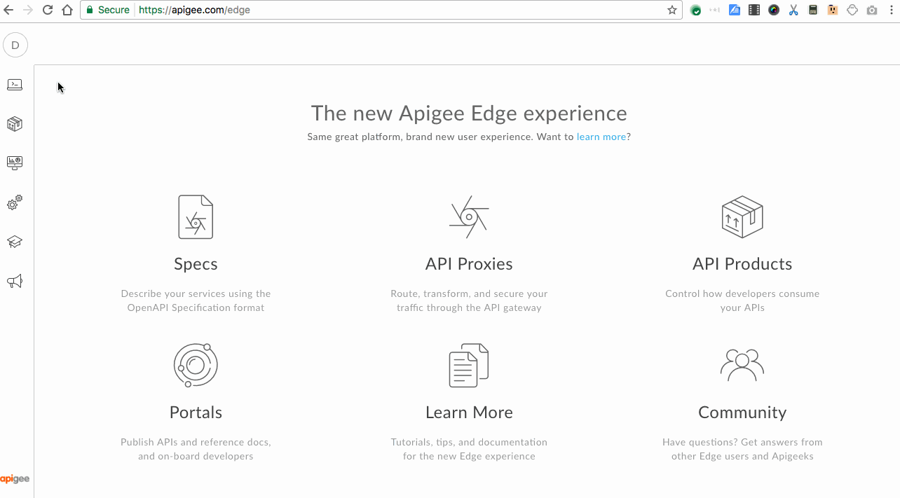
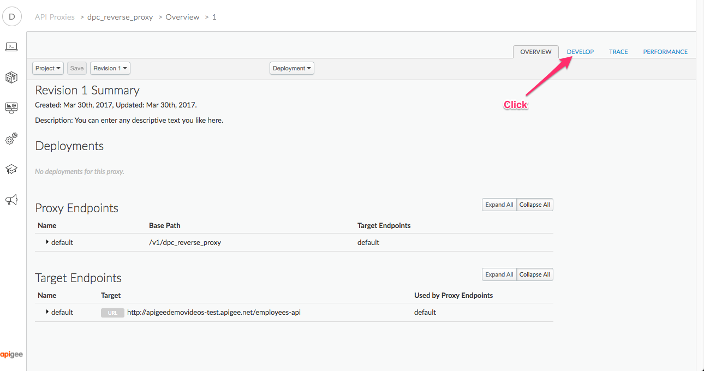
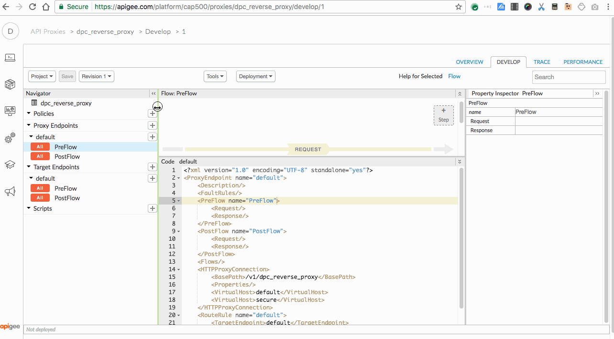
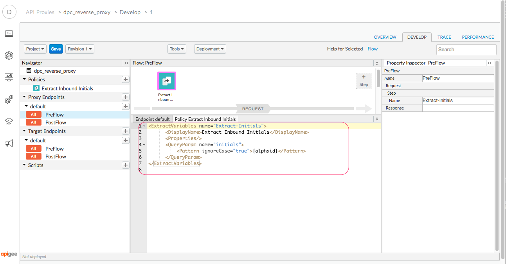
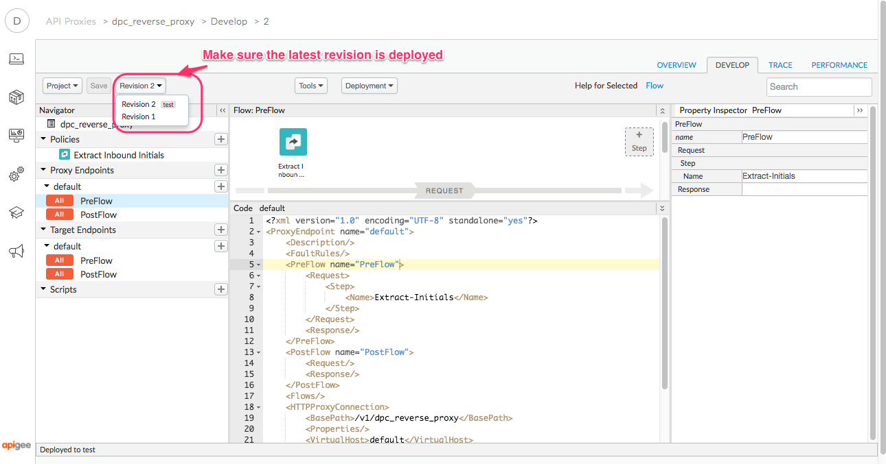
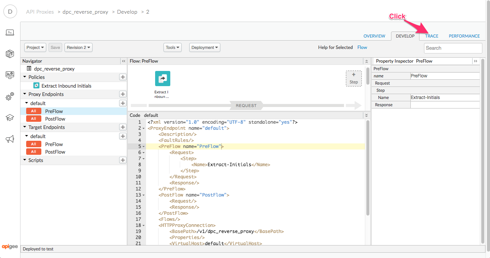
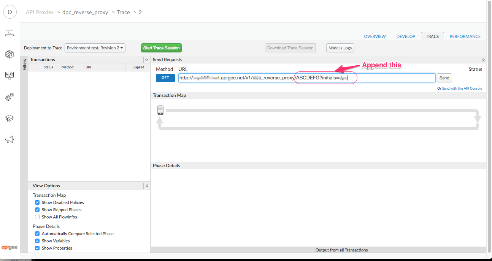
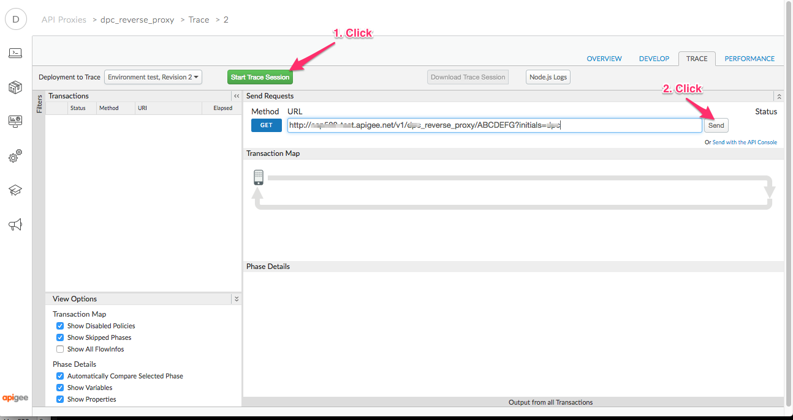
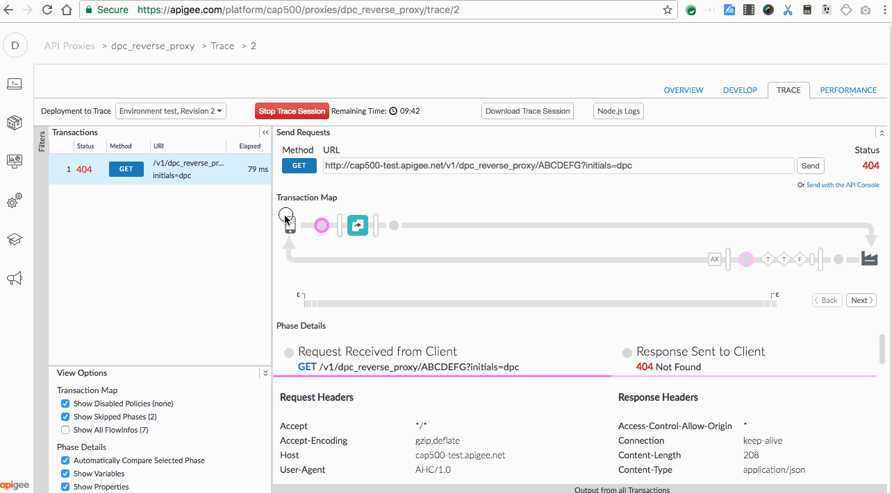
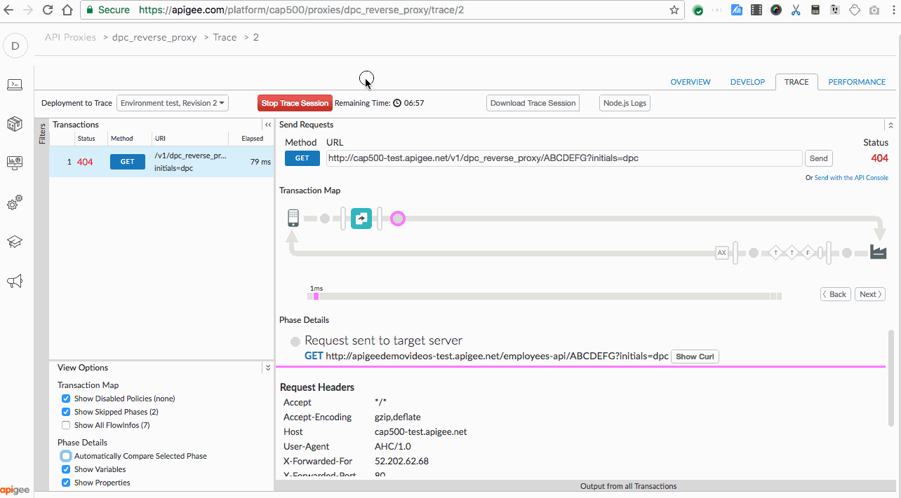

# API Diagnostics : Trace Tool

*Duration : 20 mins*

*Persona : API Team / DevOps*

# Use case

One of your team members is complaining that an API call is sporadically returning an error. You are being asked to help diagnose the issue.

# How can Apigee Edge help?

The Trace component in Edge is a powerful tool for troubleshooting and monitoring API proxy behavior. Trace provides a visualization which outlines each logical step in an API proxy flow -- policies in the request or response, routing, transformation, and so on.  With the Trace UI, you can drill into each step to understand its impact on proxy behavior.  You can also filter your view to zero in on specific requests, and you can export your Trace session for non-real-time analysis and diagnostic efforts.

In this lab, we will configure your proxy to expect a new query parameter -- called "initials" (your initials).  We will then use the trace tool to find the root cause of a 404 error, filtering the view to show only those requests containing your initials.

# Pre-requisites

You have an API proxy created in Apigee Edge.  If not, jump back to the [Create a Reverse Proxy](../01---API-Development---Create-a-Reverse-Proxy) lab.

# Instructions

## Part 1 - Configure API Proxy

1. Go to [https://apigee.com/edge](https://apigee.com/edge) and be sure you are logged in. This is the Edge management UI.

2. Select **Develop → API Proxies** in the side navigation menu

   

3. Select the **{your_initials}_reverse_proxy** that you created in an earlier lab exercise. 

4. Click on the **Develop** tab to access the API Proxy development dashboard.

   

5. Click on **PreFlow** under Proxy Endpoints default, Click on **+Step** on the Request flow to attach an *Extract Variables* policy.

   

6. In the dialog that is presented, scroll down about 75%, and select
   **Extract Variables Policy**. Specify "Extract Inbound Initials" for the
   Display Name, and click on the **Add** button to add the Extract
   Variables policy.

   After you click Add, the Extract Variables policy icon will be
   visible on the request flow. It shows where the policy is
   attached. The corresponding XML (in keeping with Edge’s
   config-then-code approach) can be seen in the edit pane below.

7. Change the Policy XML configuration to match the code below. (Ctrl-C
   to copy the below, Click in the pane, ctrl-A to select all, then
   Ctrl-V to paste in what is below).  The modified proxy will then
   extract the inbound query parameter into a separate context variable,
   available for subsequent policies in the API proxy.

   Note: Paste the following code without change. 

   ```
   <ExtractVariables name="Extract-Initials">
       <DisplayName>Extract Inbound Initials</DisplayName>
       <Properties/>
       <QueryParam name="initials">
           <Pattern ignoreCase="true">{alphaid}</Pattern>
       </QueryParam>
   </ExtractVariables>
   ```

   It should look like this:
   
  
8. Click the blue **Save** button to save your proxy.  You may see a dialog asking you to "Save a new Revision".  Do so.

9. Deploy the revision. Verify that the correct revision is deployed.

   

   Your revision need not be revision 2.  Just make sure the latest revision of your API proxy is deployed.
  

## Part 2 - Trace and Troubleshoot

Consider a scenario where one of your API consumers reports seeing 404 errors in response to their requests.  How would you get to the bottom of this issue?  The Trace tool allows you to isolate that user’s requests and step through proxy logic one step at a time.  Let’s send some traceable requests -- note the failure -- and attempt to understand why it’s failing.

1. Click on the **TRACE** tab to access the real-time API Trace tool.

   

2. Locate the URL field and append "/ABCDEFG?initials=xxx" to it, using your own initials.

   

3. Click the green **Start Trace Session** button, then click **Send**.

   

4. Notice a trace log is captured, with a 404 response.

5. Step through the visualization, clicking points of interest along the request/response flow and taking note of the metadata provided at the bottom of the screen.

   

6. *Congratulations!* You’ve found the problem.  Your target service
   cannot find an entity with the ID provided: ABCDEFG.  This is a
   trivial example, but you can see how the tool -- providing before and
   after insight into message, query, and header contents -- would be of
   immense use in diagnosing malformed requests, target errors, and
   other common issues.

7. Edit your URL field to replace ABCDEFG with  da94d538-d793-11e6-a734-122e0737977d . The full pattern is below: 

   ```
   /da94d538-d793-11e6-a734-122e0737977d?initials={your initials}
   ```

8. Again, click the **Send** button. This time, your request returns a valid JSON response.

9. Now, on the left hand side, highlight the successful transaction, and you can view the processing of that request and response. 


## Part 3 - Filtering

Now, imagine troubleshooting this issue - except with hundreds or thousands of requests flowing through the system at a given time.  Fortunately, the Trace tool can filter its real-time capture so that it only shows entries with a given query or header parameter.

1. Click the red **Stop Trace Session** button. Expand the filters pane on the left side of your screen.  

   

2. Add a query parameter filter named ‘initials’.  Put your initials in the value column and ensure the URL also holds your initials, like before.

3. Click the green **Start Trace Session** button, then click the **Send** button again to fire another API call.  Note the captured trace entry.

4. Update the URL with a new, different value for the initials query parameter.  xyz, or anything that is not the value you inserted for the filter. 

5. Again click the **Send** button. 

   No new trace entry is captured.  This is expected behavior, as the filter is configured to only trace requests with your initials in the query.

6. One more thing -- with your trace session still active, click the **Download Trace Session** button to export a record of the trace results.  

   This is an XML file that can be saved and viewed later. It describes everything you can see in the Trace UI.
  

# Lab Video

If you prefer to learn by watching, here is [a screencast on using the Trace tool](https://youtu.be/luCU2XTh5J0)

# For Extra Credit

1. Take a few minutes and explore the Trace interface a bit deeper.
   Hover over the steps in the request/response visualization and note
   the Latency bubble that pops up, showing you how much time elapsed at
   that particular step.  Drill into the metadata in the bottom window.
   Click the ‘Extract Variables’ policy and note that the initials you
   provided are shown as an extracted variable called ‘alphaid’.

2. Take a look at the exported trace session from the lab.  See if you
   can interpret the results -- imagine some scenarios where this export
   could be ingested into other tools for offline diagnostics.

3. What if you send in a request from a different client - for example
   the [Apigee REST client](https://apigee-rest-client.appspot.com/)?  What
   effect does this have on the trace facility?


# For Discussion

1. Name two kinds of metadata the Trace tool provides you with.

2. What criteria can be used to filter Trace results?

3. Will the Trace utility be useful for logging all transactions? Why or why not?

4. Could you programmatically start a trace session and collect data for requests, during a CI/CD pipeline?  How?


# Summary

In this lab, you learned how to diagnose a reported problem with your API in real-time using the Trace tool.  You learned how to filter those results down to a relevant subset of data -- and how to export the results for later review. 

# References

* Apigee Docs: [Using the Trace tool](http://docs.apigee.com/api-services/content/using-trace-tool-0)

* [Apigee Community on Tracing](https://community.apigee.com/topics/trace.html)

* Watch this [4-minute video to learn about the Trace Tool](https://community.apigee.com/articles/36248/apigee-4mv4d-api-proxy-trace-console.html)

# Rate this lab

How did you link this lab? Rate [here](https://docs.google.com/a/google.com/forms/d/1Rc17-TqTtqfXgOu9SqYbVGyAzssnANftD2Hpspmr1KQ).

