# API Security : Securing APIs with API Key

*Duration : 30 mins*

*Persona : API Team*

# Use case

You have an API Proxy that you want to secure, so that you can manage access and perform business logic based on the client making the call.  In addition authorizing users, you want to know which Developer App is making calls so you can leverage that data to customize your API behavior based on the entitlement level of the caller, or even the specific caller.  You also would like to be able to see who is calling your API Proxies in your Analytics dashboards.

# How can Apigee Edge help?

The [Verify API Key Policy](http://docs.apigee.com/api-services/reference/verify-api-key-policy) in Edge authenticates that the call is coming from an approved application in a valid state.  App developers who wish to access secure operations must request [API keys](http://docs.apigee.com/api-services/content/api-keys) for their apps via the developer portal.

In addition to authenticating requests, the [Verify API Key Policy](http://docs.apigee.com/api-services/reference/verify-api-key-policy) provides context about who is making the call.  This context can be used to apply policies such as Quota management or routing based on the client app.  Upon successful verification of the API Key, the API Context is populated with details about the App, Developer, and API Product associated with the call.  This data can be used for applying business logic as well as gaining business insights through analytics.

In this lab, you will protect an existing API Proxy with the [Verify API Key Policy](http://docs.apigee.com/api-services/reference/verify-api-key-policy) and use the trace tool to see the policy in action.  To accomplish this you will modify an existing API Proxy to add a security policy to handle the authorization.

To obtain a proper API Key, you will also need to create several artifacts in your [Organization](http://docs.apigee.com/app-services/content/organization): 

* [API Product](http://docs.apigee.com/developer-services/content/what-api-product) - an item that is consumable by external developers

* [App Developer](http://docs.apigee.com/developer-services/content/adding-developers-your-api-product) - a registered person

* [Developer App](http://docs.apigee.com/developer-services/content/creating-apps-surface-your-api) - for our purposes, this is really a "named" API Key. 

# Pre-requisites

For this lab, you will need an API Proxy that is not currently secured.  If you do not have an API Proxy available for this lab, revisit [Lab 1](../01-Create-a-Reverse-Proxy).  Then return here to complete these steps.

# Instructions

## Choose (and invoke) an API Proxy to secure

1. Go to [https://apigee.com/edge](https://apigee.com/edge) and be sure you are logged in. 

2. Select **Develop → API Proxies**

   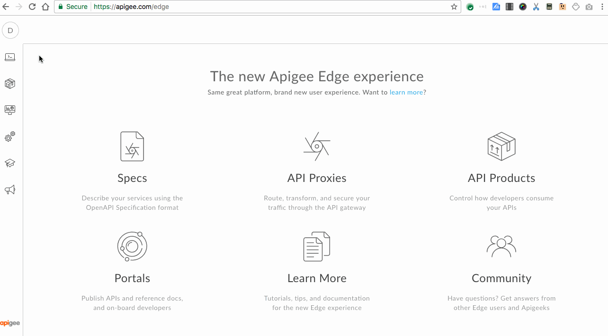

3. Find and open the API Proxy you want to secure by clicking on it.

   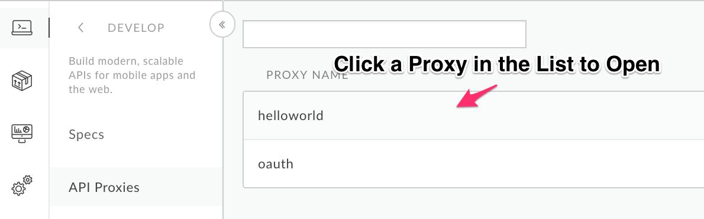

4. Verify that the API Proxy is deployed to an environment from the
   **Overview** page.  Environment(s) to which the selected revision of the
   API Proxy is deployed will be indicated by a green circle. If it is not
   deployed, click an environment from the "Deployment" pull-down to deploy
   the API Proxy to that environment.

   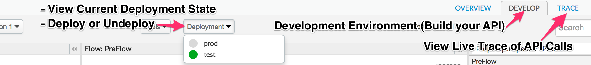

5. Verify that you can successfully make calls, using the built-in trace tool.

6. Click the **Trace** tab near the top of the window.

   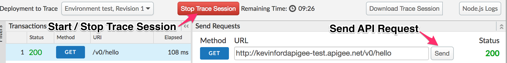
  
   The Trace view allows you to initiate tracing for up to 10 minutes,
   during which time all requests (regardless of whether they are sent
   from the trace tool or any other client) will be captured and their
   traces made visible to you.

7. Click **Start Trace Session** to begin a trace session.

8. Click **Send** to send a request.  If your API Proxy requires query
   parameters add them here prior to sending.

9. You should see a successful 2xx response for your API Call

 . If you are not able to successfully test an API Proxy in the Trace
   Tool, revisit [Lab 1](../01-Create-a-Reverse-Proxy).


## Publish API as part of API Product

Once an API Proxy is secured, consuming apps will need an API Key to
successfully invoke it.  The unit of consumption - in other words the
thing that a Developer App (also known as "client", or "consumer") is
authorized for - is an API Product.  API Products are the things that
appear in the searchable API catalog in the Developer Portal, where App
Developers can learn about and register for APIs.  Read more about API
Products
[here](http://docs.apigee.com/developer-services/content/what-api-product).

1. In the Apigee UI, select **Publish → API Products** from the side navigation menu

   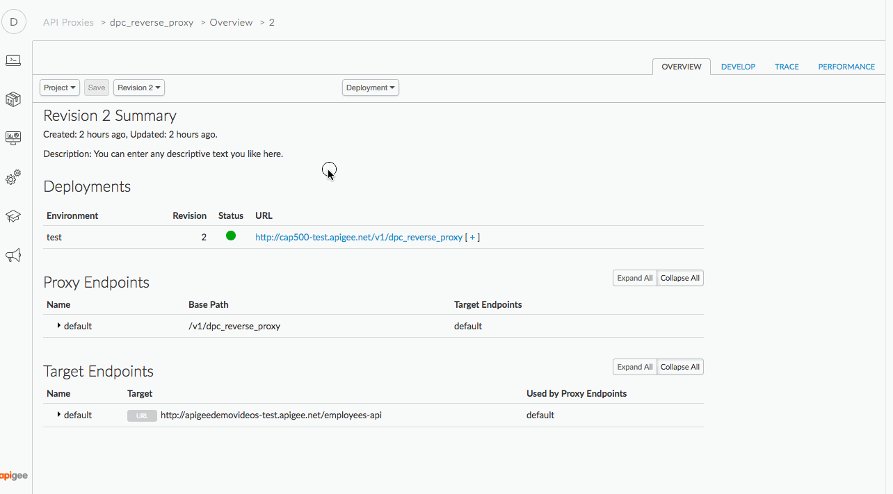

2. Click **+API Product**

   

3. Populate the following fields

    * Section: Product Details

        * Name: **{your_initials}_{api_name}**_product
        * Environment: test
        * Access: Public

    * Section: Resources

        * Section: API Proxies

            * Click the **+API Proxy** button
            
              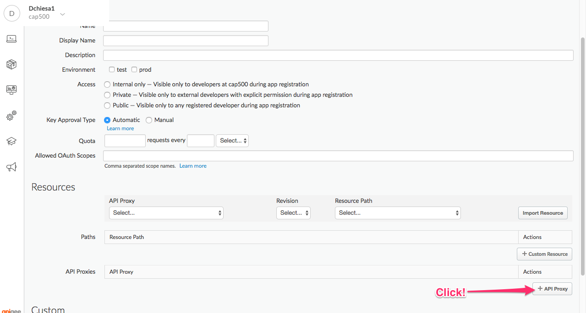

            * Select your API Proxy

4. Click the blue **Save** button on the bottom right corner of the page, to save the API Product.
  
   There is now a new, consumable unit of APIs available to external (consuming) developers. 


## Create An App Developer

Next we will create an App Developer who can consume the new API Product.

1. Select **Publish → Developers** from the side navigation menu

   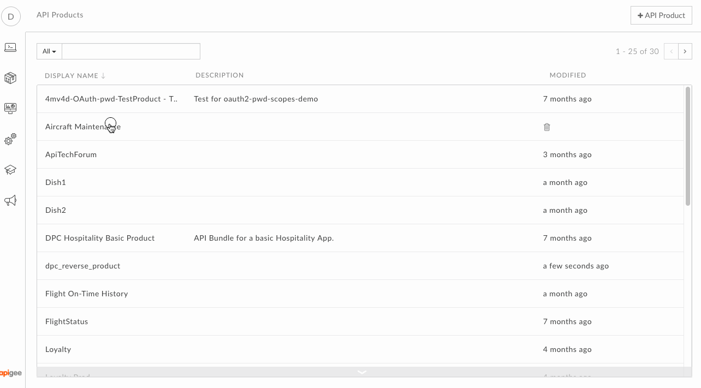

2. Click **+Developer**

   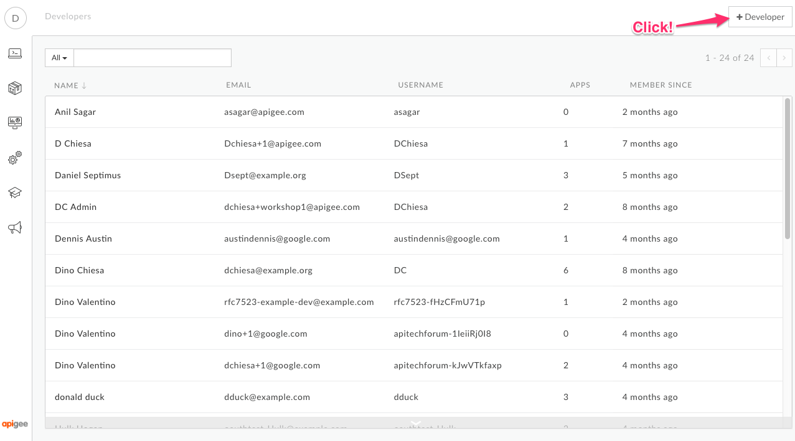

3. Populate the following fields

    * First Name: **{your_first_name}**
    * Last Name: **{your_last_name}**
    * Email: **{your_email}**
    * Username: **{your_initials}**_apikeylab_developer

4. Click **Create** to save the new App Developer.

   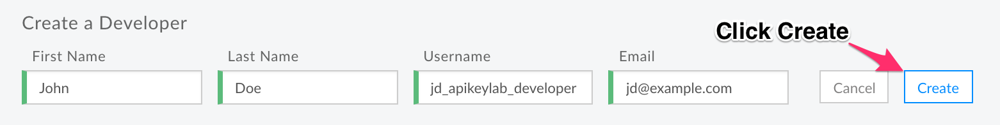


## Create An App And Retrieve its API Key

There can be  any number of Apps assigned to a single App Developer. Each App can register for any number of products. We will create an App for our new App Developer, and register it with one API Product: the API Product we created earlier in the lab. Read more about Developer Apps [here](http://docs.apigee.com/developer-services/content/creating-apps-surface-your-api).

1. Click **Publish → Apps** in the side navigation

   

2. Click **+App**

   

3. Populate the following fields

    * Name: **{your_initials}_{product_name}**_app
    * Developer: Select the developer you created from the pulldown.
    * Product: Click **+Product** to add your API Product to this App.

   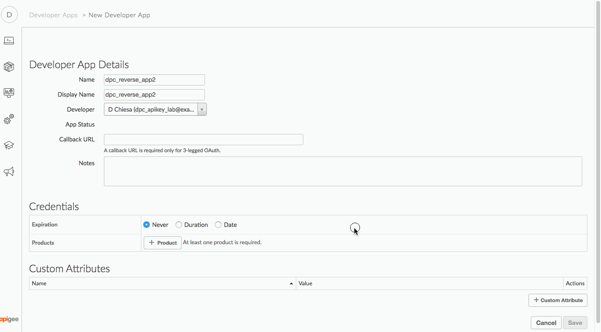

4. In the lower right corner, click the blue **Save** button.

5. Open the newly created App and click *Show* under *Consumer Key*.
   This will reveal the API Key that must be used to invoke the API when
   API Key verification is in use.  Copy this key into a text document for
   later use.

   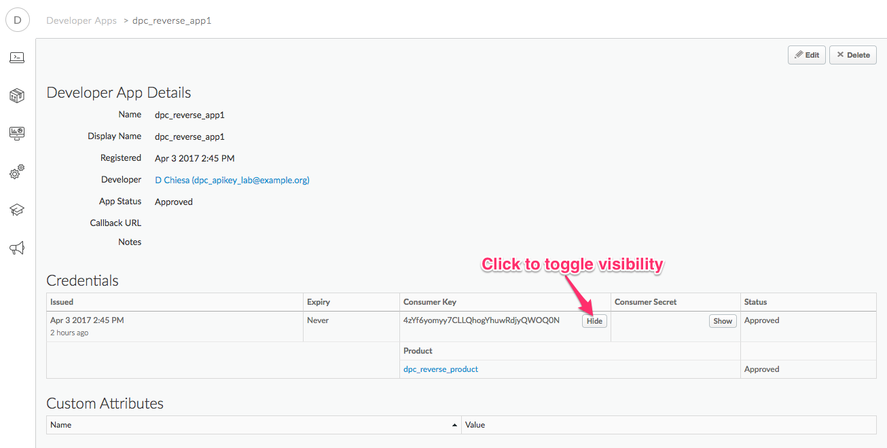


## Add a Verify API Key Policy

1. Menu: **Develop > API Proxies**

2. Open your API Proxy and click the **Develop** tab to see the flow
   editor (you may have to move the panes to see the full request and
   response flow lines)

3. Click **+Step** on the request flow and select *Verify API Key*
   policy from the *Security* section of the list.  The name can be
   changed or left at the default.

4. Click **Add**

5. The policy will be added after any policies you previously had in the
   Request flow.  Since we likely want this to occur first, drag the new
   policy to be the leftmost.

6. With the *Verify API Key* policy selected, you can see its
   configuration (the default policy configuration is below). Note that
   the API Key is being retrieved from the context as the variable
   *request.queryparam.apikey*.  This is the default but the policy can
   be configured to retrieve the key from any parameter key you prefer.

   ```
   <VerifyAPIKey name="Verify-API-Key-1">
     <DisplayName>Verify API Key-1</DisplayName>
     <APIKey ref="request.queryparam.apikey"/>
   </VerifyAPIKey>
   ```

7. **Save** the API Proxy.

8. Click the **Trace** tab near the top of the window.

9. Click **Start Trace Session** to begin a trace session.

9. Click **Send** to send a request. If your API Proxy requires query
   parameters add them dire prior to sending (Do not add the API Key yet)

9. You should see a 401 (unauthorized) response for your API Call
   because the API Proxy was expecting an API Key as a query parameter.
   See the trace session below

9. Now add the query parameter ```?apikey={your_api_key}``` to the URL
   in the trace tool and try again. (Use the API Key you created above, and
   resend the request.

9. You should see a 2xx response code and the Trace for that request
   should show that the Verify API Key policy is now passing.

   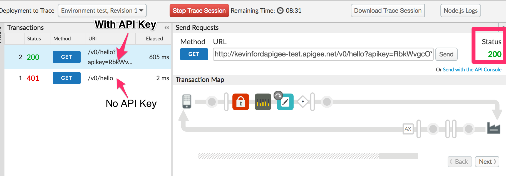


# Lab Video

If you would rather watch a video that covers this topic, point your browser [here](https://youtu.be/3nUFCOgGlS8).

# For Extra Credit

1. Now that you have secured an API Proxy with API Key, you have access to details about the calling App, Developer, and associated API Product in the API flow.  See if you can locate these details in the Trace UI for a protected API call.

   A few examples of where this might be useful.

     * Route to a sandbox backend when a Product has the custom attribute of sandbox=true.

     * Implement different quota policies for Apps that have been approved but not yet verified.

     * Analyze traffic by calling App, Developer, or Product

2. What happens if you revoke the app or Credential, and retry the requests?  What happens if you re-approve those things? 


# For Discussion

1. What would happen if a Quota Policy were placed before the Verify API Key policy?

2. Why is the Verify API Key policy typically found as the first policy in the Request PreFlow?  When might it be in a conditional PreFlow instead of the "All" PreFlow?

3. How would you configure the policy to get the API Key from a header called "Api-Key" instead of the default query parameter location?


# Summary

In this lab you learned how to protect your API Proxy using the Verify API Key policy.  You implemented the policy and tested it using the built-in Trace Tool.

# References

* Link to Apigee docs: [Verify Api Key Policy](http://docs.apigee.com/api-services/reference/verify-api-key-policy)

# Rate this lab

How did you link this lab? Rate [here](https://goo.gl/forms/XxDqVtWHnyFdEChv1).

