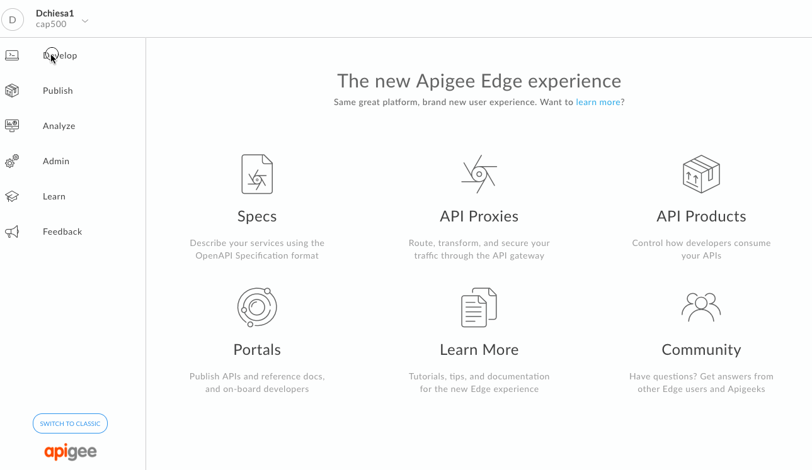
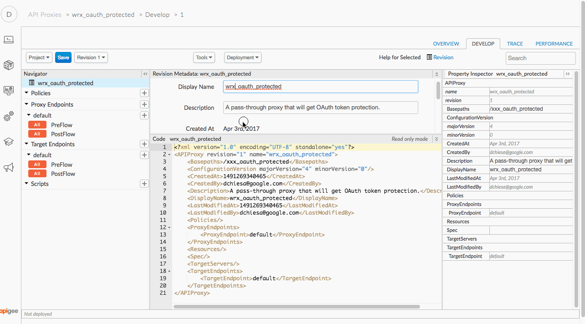
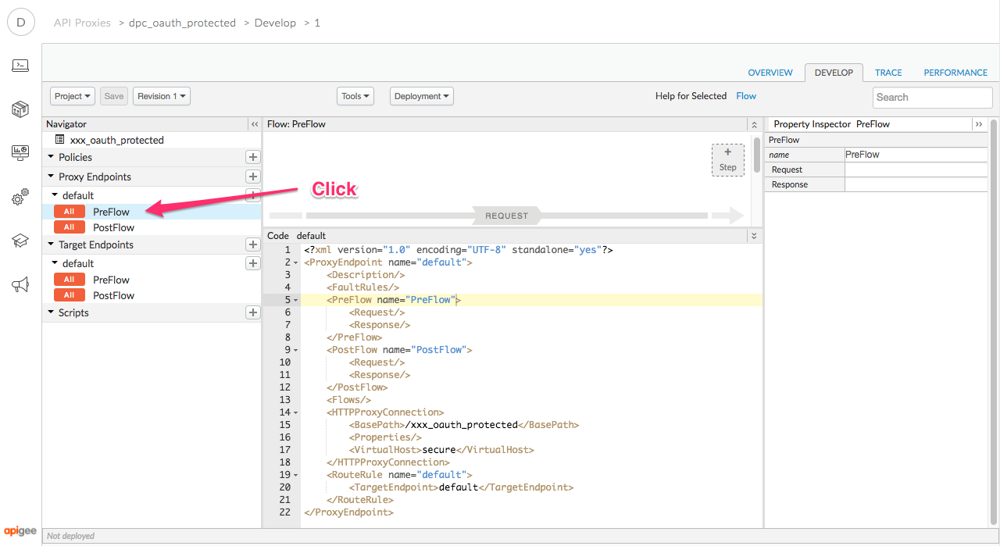
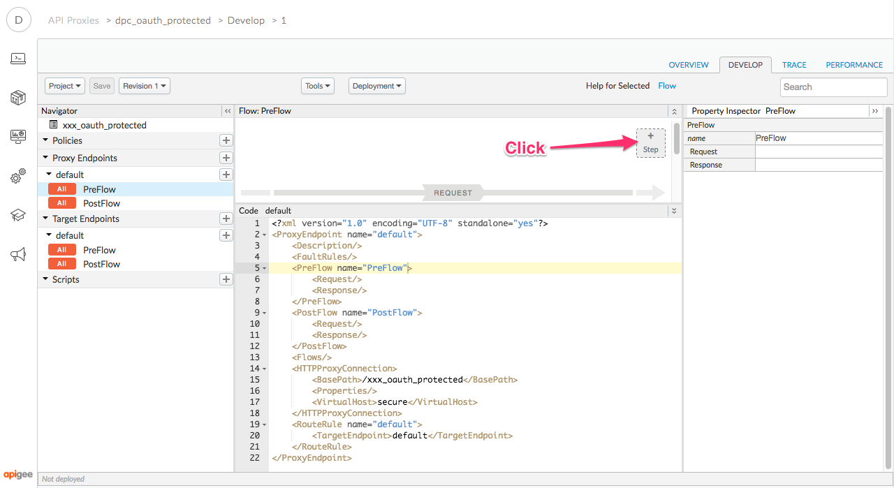
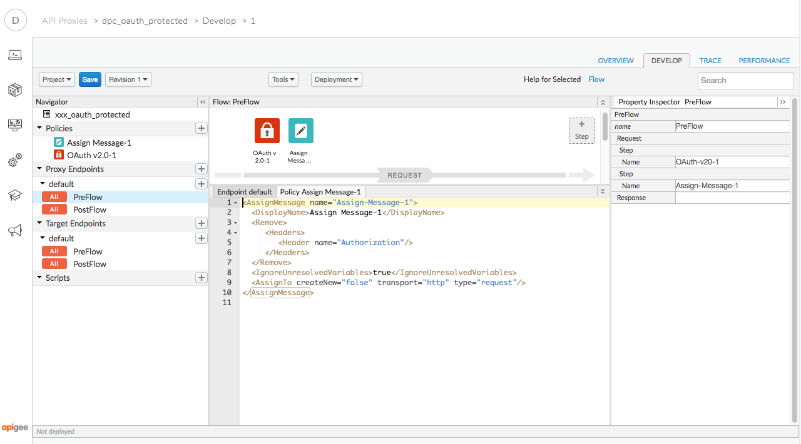
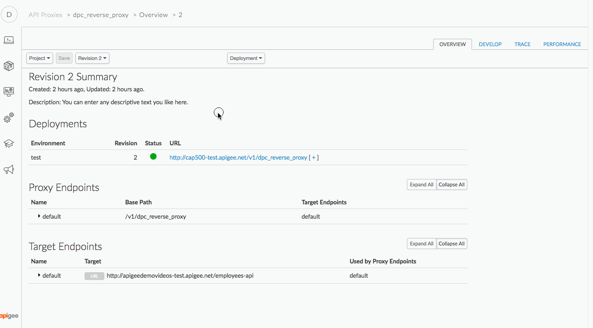
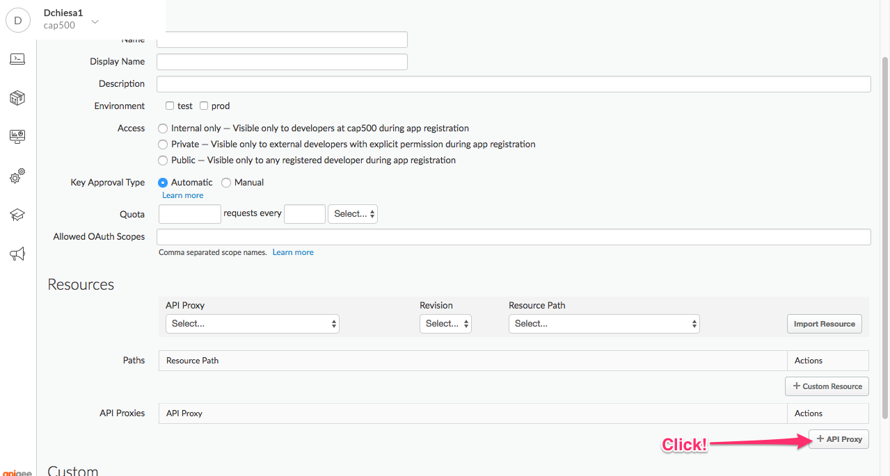
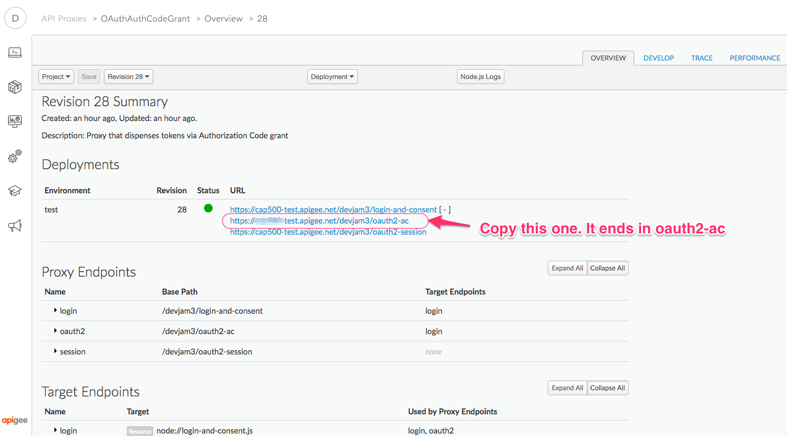

# API Security : Securing APIs with OAuth (3-legged) 

*Duration : 30 mins*

*Persona : API Team/Security*

# Use case

You have a set of APIs that are consumed by trusted partners. You want to secure those APIs using a three legged OAuth (Authorization Code flow).

# How can Apigee Edge help?

[The OAuth specification](https://tools.ietf.org/html/rfc6749) defines token endpoints, authorization endpoints, and refresh endpoints. Apps call these endpoints to get access tokens, to refresh access tokens, and, when using 3-legged OAuth, to kick off the authorization code flow.

Apigee Edge quickly lets you secure your APIs using out of the box OAuth policies. Apigee Edge OAuth policies 
can be used to implement the standard OAuth endpoints, and lets you easily secure your APIs using a simply policy to verify tokens.

Authorization code is one of the most commonly used OAuth 2.0 grant types. The authorization code flow is also sometimes called the "three-legged OAuth" configuration. In this configuration, the user authenticates himself with the resource server and gives the app consent to access his protected resources without divulging username/passwords to the client app. This grant type is intended for apps that are written by third-party developers who should not be trusted to handle the user credentials. For example, developers who register for public API programs should not generally be trusted. With this grant type, the user's credentials on the resource server are never shared with the app. 

# Background: What are the Three Legs?

The "three legs" in the name refer to the User Identity Server, the resource (API) server, and the client app itself. These are three pieces of software that are involved in an exchange. 

The idea is that the user will authenticate to the Identity Server, which will confirm that with the resource (API) server, which will generate a token and provide it to the app, on behalf of the user. In this way the user never directly provides credentials to the application. The theory is the user can then control which apps have access to resources on his or her behalf. 

The flow looks like this:


In a 3-legged flow, Apigee Edge acts as the OAuth authorization server. Its role is to generate access tokens, validate access tokens, and proxy authorized requests for protected resources on to the resource server. Apigee Edge delegates user authentication to the Identity Provider. 


# Pre-requisites

1. You have a login to Apigee Edge, and your organization includes the devjam oauth2-ac API proxy.  Your lab proctor can help with that, or you can deploy your own. See [the proxy bundle](../../../Resources/oauth2-ac).


# Instructions

If you have completed the 2-legged OAuth exercise, then, you do not need
to create a different API Proxy, or API Product, or App. If you **have not** completed that
exercise, you must create those three things now. Do so, like this: 

## First, Create the API Proxy 

1. First, download [this zip file](./code/apiproxy_xxx_oauth_protected.zip) to your local machine, by clicking the link, and then clicking "Download". Then return here.

2. Go to [https://apigee.com/edge](https://apigee.com/edge) and be sure you are logged in.

3. Select **Develop → API Proxies** in the side navigation menu

   

4. Click **+ Proxy**. The Build a Proxy wizard is invoked.

   

5. Select **Proxy bundle**. Click on **Next**, and then choose the zip file that you just downloaded.

   

2. Specify the name for the new proxy, using your initials..., and click **Next**

   

2. Then click **Build**

   

2. Once the API proxy has been built, **click** the link to view your proxy in the proxy editor. 

2. You should see the proxy **Overview** screen. 

2. Click the **Develop** tab.

   

   This shows you the contents of the API Proxy definition. This is just a pass-through proxy. There are no logic steps on this proxy, yet. 

3. Select the Proxy name and Update the display name with your initials.

   

4. Select the Proxy Endpoint and update the basepath, similarly.

   

2. Select **PreFlow** from the sidebar under **Proxy Endpoints** section.

   

2. Click on **+Step**

   

2. In the resulting dialog, scroll down select **OAuth v2.0** from the Security section then click the **Add** button.

   

2. Click on the policy and in the code editor, paste the code given below:

   ```
   <OAuthV2 name="OAuth-v20-1">
      <DisplayName>OAuth v2.0-1</DisplayName>
      <ExternalAuthorization>false</ExternalAuthorization>
      <Operation>VerifyAccessToken</Operation>
      <GenerateResponse enabled="true"/>
   </OAuthV2>
   ```

   It should look like this: 

   

2. Because we want Apigee to not pass the token to the backend API, let's remove the Authorization header. To do so, again click on **+Step**.

2. In the dialog, select **Assign Message** policy from the Mediation section then click the **Add** button.

   

2. Click on the policy and in the code editor, paste the code give below

   ```
   <AssignMessage name="Assign-Message-1">
     <DisplayName>Assign Message-1</DisplayName>
     <Remove>
        <Headers>
           <Header name="Authorization"/>
        </Headers>
     </Remove>
     <IgnoreUnresolvedVariables>true</IgnoreUnresolvedVariables>
     <AssignTo createNew="false" transport="http" type="request"/>
   </AssignMessage>
   ```

   It should look like this:

   


2. Click the blue **Save** button to save the proxy.

2. *Congratulations!*...You’ve now successfully created an API in Apigee Edge that is protected with OAuth 2.0.

2. Use the Deployment dropdown to deploy it on the **test** environment.

   


## Second, Create the API Product

Once again, if you have completed the exercise for the OAuth 2-legged
flow, you do not have to complete this set of steps. 

1. In the Apigee UI, select **Publish → API Products** from the side navigation menu

   

2. Click **+API Product**

   

3. Populate the following fields

    * Section: Product Details

        * Name: **{your_initials}**_oauth_product

        * Environment: test

        * Access: Public

        * Allowed OAuth Scopes: A,B,C

    * Section: Resources

        * Section: API Proxies

            * Click the **+API Proxy** button
            
              

            * Select the API Proxy you just created.

4. Click the blue **Save** button on the bottom right corner of the page, to save the API Product.
  
   There is now a new, consumable unit of APIs available to external (consuming) developers. 

   Side note: What is an OAuth scope?  A scope is something you can attach to an OAuth token that
   stipulates or limits the authorization associated to the token.  For example, you could define
   READ and WRITE scopes on a single resource.  Or, you could imagine a 2x2 matrix of {READ,WRITE} and {RESOURCE1,RESOURCE2}.
   A user may wish to grant READ access to an app (let's say, ability to read a "favorites list"),
   or WRITE access to the app (eg, ability to update the "favorites list"). For more on OAuth scopes,
   please see [this article](https://www.oauth.com/oauth2-servers/scope/defining-scopes/).

   Apigee Edge allows you to define any set of scopes that *can be* attached to a token, and allows
   users the ability to restrict the set of scopes they grant to an app. 


## Third, Create the App

Again, you need to do this only if you have not created an App for the
2-legged OAuth exercise.

1. Click **Publish → Apps** in the side navigation

   

2. Click **+App**

   

3. Populate the following fields

    * Name: **{your_initials}**-oauth-app

    * Developer: (choose any available developer)

    * Product: Click **+Product** to add your API Product to this App.

   

4. In the lower right corner, click the blue **Save** button.


## Get the client credentials

Now, obtain the consumer key and secret for the app, and encode them. 

1. In the apps list, select the app that you just created

2. Click on the show button under Consumer Key and Consumer Secret.

3. Copy the values and store them somewhere safe.


## Obtain a token

Now, we'll go through the 3-legged flow to obtain a token that
authenticates both the client app and the end user of the app.

1. In the Apigee UI, Navigate to Develop...Proxies...

2. Select the API Proxy called oauth2-ac (or similar).

3. From the Proxy overview panel, copy the URL for your OAuth API proxy. 

   

   The url should end with oauth2-ac; we use ac here to imply authorization code, the
   OAuth grant type that this token-dispensing proxy supports.

4. Click the Trace tab. Start a Trace session on the OAuth proxy. Later, you
   can view this session to see the message exchanges. 

5. Open a new, empty browser tab.

6. To obtain an access token via 3-legged OAuth, you need to construct the URL, with these settings:

   * url endpoint: https://YOURORG-test.apigee.net/devjam3/oauth2-ac/authorize?
   * append these query params (separated by &):
       * `client_id`: **{your client_id from above}**
       * `redirect_uri`: http://dinochiesa.github.io/openid-connect/callback-handler.html
       * `response_type`: code
       * `scope`: A
   * method: GET

   The url should look like this:
   ```
   https://YOURORG-test.apigee.net/devjam3/oauth2-ac/authorize?client_id=lq93FiqTw1si09wsocM7AjOBSbyi45iA&redirect_uri=http://dinochiesa.github.io/openid-connect/callback-handler.html&response_type=code&scope=A
   ```

   Paste the resulting URL into the address bar of the empty browser tab.

6. You should see a login screen, like this:

   

   This login screen is actually being served by Apigee Edge. In the normal case, the
   login-and-consent user experience is somethiing the API provider exposes
   independently. It will have branding corresponding to the API provider, and will
   be a common experience that will apply to multiple, perhaps many, third party apps.
   Every time a user authorizes a new third-party app, they'll go through the same
   user login-and-consent experience.
   
   
6. Authenticate as a user, with one of the username/password pairs given to you
   by your instructor.  dino@apigee.com / IloveAPIs might work.

6. After authenticating, you will then be asked to provide consent to the app.
   This interaction collects consent from the user that App X will have the requested scopes.

7. After you consent, you should then see an authorization code in your browser.
   Copy that code.

   In the normal flow, the user then provides that code to the app, by pasting it into an app screen.
   We will simulate this by using the [Apigee REST Client](https://apigee-rest-client.appspot.com/) to invoke the appropriate request.

8. Open a browser tab with the [Apigee REST Client](https://apigee-rest-client.appspot.com/)

9. Specify these settings:

   * url endpoint: `https://{YOURORG}-test.apigee.net/devjam3/oauth2-ac/token`
   * method: POST
   * Header parameters: none!
   * Body parameters:
      * `grant_type` : `authorization_code`
      * `client_id` : **{your client id}**
      * `client_secret` : **{your client secret}**
      * `code` : **{the code you received after consent}**
      * `redirect_uri` : `http://dinochiesa.github.io/openid-connect/callback-handler.html`
      
   

   Here, you need to verify that you have CLEARED any Header parameters. There may be
   some header params still in the web form, from your prior requests. Remove them. 

9. Click **Send**. You should see a response like the following:

   

9. Copy the access_token value. 

9. Flip back to the Apigee UI.  Examine the trace UI, to see the various requests.
   Note: You may see requests from other developers working on the same exercise.


## Use the token

1. In the Apigee UI, Navigate to Develop...Proxies....

2. Select the API Proxy called *xxx*_oauth_protected (starting with your
   initials). This is the API proxy that you created previously. It 
   includes the VerifyAccessToken policy.

3. In the proxy overview panel, copy the URL for this proxy.

  
   
3. Optionally, you can turn on Tracing for this API Proxy.  
   
4. In the browser tab with the [Apigee REST Client](https://apigee-rest-client.appspot.com/),
   paste in the proxy URL. Also specify:

   * method: GET
   * Headers:
      * `Authorization` : `Bearer ` **{your access token}**

5. Click **Send**.  You should see a 200 OK response.

5. If you like, modify the token to be some other value, an invalid value. Click **Send** again.  You should see a 401 response.

6. If earlier,you started a Tracing session in Apigee Edge for this API Proxy, you might want to flip back to that browser tab to examine the transactions. 


# Lab Video

You can watch [this short video to see how to implement 3 legged OAuth on Apigee Edge.](https://youtu.be/vPryGej4ydg) 


# For Extra Credit

1. See if you can use Header Injection to add a header to be sent to the backend API.  The header name can be anything you choose, and the value should be something taken from the token attributes.

2. Modify the Expiry of generated tokens and see how the token response changes.

3. Test the re-use of the same authorization code, two or more times. What happens?


# For Discussion and Consideration

1. At what point in the flow we followed above is the client app authenticated? Before or after the user is authenticated?

2. Why does the 3-legged flow require a Web browser to participate in the flow? Would it be ok for a slick app to use one of the "embedded web browser" controls, for iOS, Android, .NET and so on?  What are the security considerations here? 

2. We saw that tokens can have scopes attached. What scopes are possible? How would an API Proxy evaluate scopes on a token, in order to make authorization decisions? Could an API proxy also evaluate user roles, or groups, some attribute obtained from the Identity Provider (like Active Directory)?

3. Would you ever have the need to use tokens obtained via client credentials grants, as well as tokens obtained via authorization code grants, from within the same application?  If so, under what circumstances? 


# Summary

In this lab you learned how to secure your API using a three legged OAuth, obtaining an auth code, exchanging it for an access token and using that against your API.

# References

* Link to Apigee docs page

    * [OAuth 2.0: Configuring a new API proxy](http://docs.apigee.com/api-services/content/understanding-default-oauth-20-configuration)

    * [Secure an API with OAuth - Authorization Grant Type](http://docs.apigee.com/api-services/content/oauth-v2-policy-authorization-code-grant-type) 

* [Community posts and articles with topic as "OAuth 2.0"](https://community.apigee.com/topics/oauth+2.0.html) 

* [Search and Revoke tokens](https://community.apigee.com/articles/1571/how-to-enable-oauth-20-token-search-and-revocation.html)

# Rate this lab

How did you link this lab? Rate [here](https://drive.google.com/open?id=19YS_51mBsilVeb3FUhEGs8E6GaMhtoKJf7dulp0oUq0).

