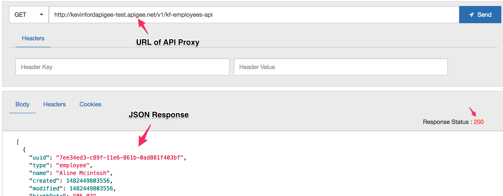
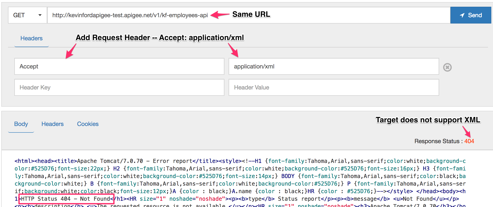
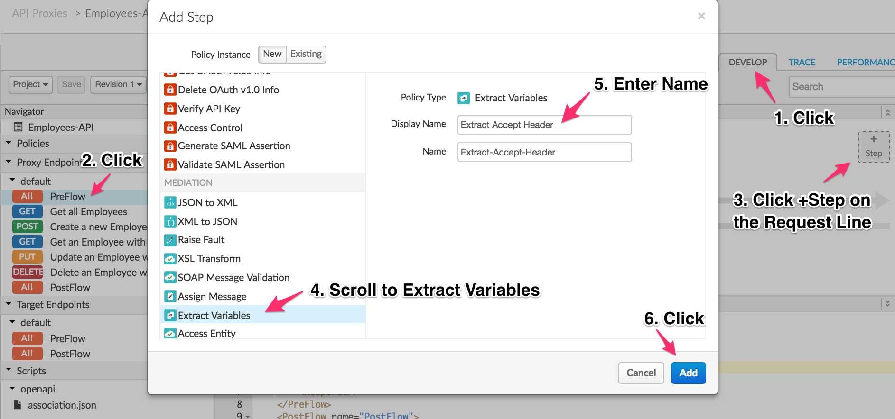
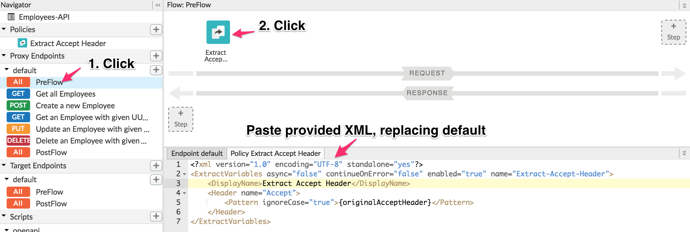
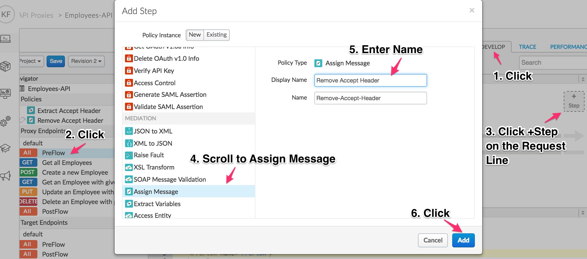
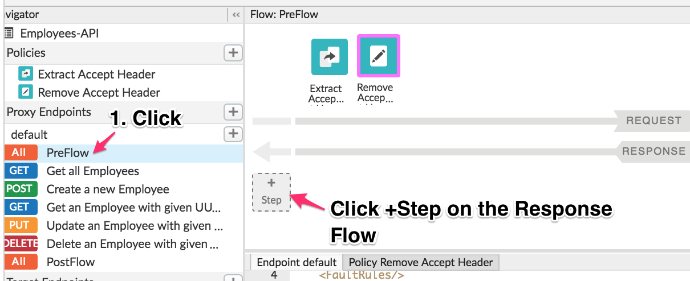

# Transformation : HTTP header injection

*Duration : 10 mins*

*Persona : API Team*

# Use case

You have an API Proxy that exposes a RESTful interface, and verifies the security of the inbound request.  You want to communicate the authenticated identity (client, or client and user) to the backend system, via an HTTP Header.

# How can Apigee Edge help?

The [AssignMessage Policy](http://docs.apigee.com/api-services/reference/assign-message-policy) in Edge allows you to set additional headers into the southbound HTTP message. This allows your backend to understand the identity authenticated by Edge.  


XXXX TO BE COntinUED 


In this lab, you will modify an existing API Proxy to allow a JSON backend to return XML to clients who request it.  To achieve this you will perform the following -

1. If a request has an Accept header of "application/xml"

    1. Remove the (XML) Accept header to allow the target to return JSON

    2. Implement the [JSON to XML Policy](http://docs.apigee.com/api-services/reference/json-xml-policy) to convert the response body from JSON to XML

    3. Inject a response header of "Content-type: application/xml".

# Pre-requisites

For this lab, you will need an API Proxy that returns JSON.  If you do not have an API Proxy available for this lab, revisit the lab "API Design : Create a Reverse Proxy with OpenAPI Specification" and then return here to complete these steps.

# Instructions

## Test existing API Proxy with different Accept Headers

* Go to [https://apigee.com/edge](https://apigee.com/edge) and log in. This is the Edge management UI

* Select **Develop → API Proxies**


* Find and open the Employee API Proxy that you want transform by clicking on it.


* Verify that the API Proxy is **deployed** to *test* environment.

* **Copy** the URL for the API Proxy from the Overview tab.


* Verify the API returns JSON data using the [Apigee Rest Client](https://apigee-rest-client.appspot.com/) or any http client of your choosing

    * Open [Apigee Rest Client](https://apigee-rest-client.appspot.com/)

    * Paste URL from **Overview** page.

    * Click **Send**.



* Make another request, this time with a header specifying that you ```Accept application/xml```.  This backend does not support XML clients so you receive a 404.



* Try making another request, explicitly setting the Accept header to ```application/json```.  It should return JSON as when you did not specify the header.

## Understanding the approach

The test has demonstrated that the backend service accepts requests with the header ```Accept: application/json``` or requests with no Accept header.  It fails for requests with the header ```Accept: application/xml```.

Our approach will be to implement four policies.  The first will read the Accept header of the request, the remaining three will implement the following logic, if and only if the first policy found the Accept header to be equal to ```application/xml```

1. Extract the *Accept* header

2. If extracted header matches ```application/xml```, replace Accept header with ```application/json``` to satisfy the backend.

…  invoke the backend.

3. If extracted header matches ```application/xml```, convert JSON to XML

4. If extracted header matches ```application/xml```, set the header ```Content-type: application/xml```.

## Open the API Proxy for Development

* Open the API Proxy and click the **Develop** tab.  All of our work will be performed in the "Default Proxy Endpoint’s All PreFlow".  To better understand Flows and the appropriate place to apply policies in Apigee Edge, Read [Understanding Flows](http://docs.apigee.com/api-services/content/understanding-flows-and-resources).


## Extract Original Accept Header

* From the **Develop** tab of the API Proxy.

* Click **Preflow** under Default Proxy Endpoint.

* Click **+Step** to add a policy to the Default Proxy Endpoint’s **Request** PreFlow.

* Select the [Extract Variables Policy](http://docs.apigee.com/api-services/reference/extract-variables-policy) from the list of policies.

* Enter *Display Name* as **Extract Accept Header**.

* Click **Add**



* The new policy is added with a default configuration.  Replace it with the code below which will extract the *Accept* header and put it into a variable *{OriginalAcceptHeader}*

```
<?xml version="1.0" encoding="UTF-8" standalone="yes"?>
<ExtractVariables continueOnError="false" enabled="true" name="Extract-Accept-Header">
    <DisplayName>Extract Accept Header</DisplayName>
    <Header name="Accept">
        <Pattern ignoreCase="true">{originalAcceptHeader}</Pattern>
    </Header>
</ExtractVariables>
```



## Overwrite Accept Header (conditionally)

* From the **Develop** tab of the API Proxy.

* Click **Preflow** under Default Proxy Endpoint.

* Click **+Step** to add a policy to the Default Proxy Endpoint’s **Request** PreFlow.

* Select the [Assign Message Policy](http://docs.apigee.com/api-services/reference/assign-message-policy) from the list of policies.

* Set the *Display Name* as **Remove Accept Header**.

* Click **Add**



* The new policy is added with a default configuration.  Like with the previous policy, replace it with the code below which will set the Accept header to *application/json*

```
<?xml version="1.0" encoding="UTF-8" standalone="yes"?>
<AssignMessage continueOnError="false" enabled="true" name="Remove-Accept-Header">
    <DisplayName>Remove Accept Header</DisplayName>
    <Set>
        <Headers>
            <Header name="Accept">application/json</Header>
        </Headers>
    </Set>
</AssignMessage>
```

* Open the Apigee Rest Client and test the API with ```Accept: application/json```. It should succeed even if you send headers like “Accept: application/invalid”.  This is because this policy is not conditional, it **always** overwrites even invalid headers.  We will fix that now by making this new policy conditional.  It will only execute when the original request has a header of *application/xml*.

* The code snippet below is a conditional statement that control execution of the policies we add to flows.  Read this to learn all about [Conditions](http://docs.apigee.com/api-services/reference/conditions-reference) in Apigee.  Add the below code snippet into the configuration pane for the request flow, as depicted below.  It will cause the Remove-Accept-Header policy to be executed only when the original request passed in *application/xml*.

```
<Condition>originalAcceptHeader EqualsCaseInsensitive "application/xml"</Condition>
```


* Open the Apigee Rest Client and run the tests again.  We’ve altered the request so the backend will give a response when the client passes us ```Accept: application/json``` or ```Accept: application/xml```.  We’re halfway there.  In the next two steps of the lab we’ll handle converting the response to XML when the client requests it.

## Convert JSON to XML (conditionally)

This policy will be added similarly to the previous two but we will be applying it to the response flow because we want to alter the response that comes from the target server.

* From the **Develop** tab of the API Proxy…

* Click **Preflow** under Default Proxy Endpoint.

* Click **+Step** to add a policy to the Default Proxy Endpoint’s **Response** PreFlow.



* Select the [JSON to XML](http://docs.apigee.com/api-services/reference/json-xml-policy) from the list of policies.

* Leave the default Display Name and Name.

* Click **Add** to add the new policy in the Response flow.

* Select the new policy and replace its default code with the snippet below

```
<?xml version="1.0" encoding="UTF-8" standalone="yes"?>
<JSONToXML continueOnError="false" enabled="true" name="JSON-to-XML-1">
    <DisplayName>JSON to XML-1</DisplayName>
</JSONToXML>
```


* This policy should be conditional as well, based on the original request’s Accept Header.  Paste the condition below into the Default Proxy Endpoint’s PreFlow, inside the Step for the Json to XML Policy.

```
<Condition>originalAcceptHeader EqualsCaseInsensitive "application/xml"</Condition>
```


## Set Content-Type Header (conditionally)

This policy will also be added to the response flow because we want to assign a Header on the response message before it is sent to the client.

* From the **Develop** tab of the API Proxy.

* Click **Preflow** under Default Proxy Endpoint.

* Click **+ Step** to add a policy to the Default Proxy Endpoint’s **Response** PreFlow.


* Select the [Assign Message](http://docs.apigee.com/api-services/reference/assign-message-policy) from the list of policies.

* Set the *Display Name* to **Set Content-Type Header**.

* Click **Add** to add the new policy in the Response flow.

* Select the new policy and replace its default code with the snippet below

```
<?xml version="1.0" encoding="UTF-8" standalone="yes"?>
<AssignMessage continueOnError="false" enabled="true" name="Set-Content-Type-Header">
    <DisplayName>Set Content-Type Header</DisplayName>
    <Set>
        <Headers>
            <Header name="Content-type">application/xml</Header>
        </Headers>
    </Set>
</AssignMessage>
```

* Make this policy depend on the same condition as the previous two, based on the original request’s Accept Header.  Paste the condition below into the Default Proxy Endpoint’s PreFlow, inside the Step for the Set-Content-Type-Header Policy.

```
<Condition>originalAcceptHeader EqualsCaseInsensitive "application/xml"</Condition>
```

# Lab Video

If you would rather watch a video that covers this topic, point your browser [here](https://youtu.be/xf9SVFBB4vg).

# Earn Extra-points

Try add a new Header on the response that contains a value you pass in as a Query Parameter.  For example.. [http://api.example.com/v1/myapi?debug=true](http://api.example.com/v1/myapi?debug=true) could cause your backend to respond with a Header that includes the client’s IP address (hint: the variable is called proxy.client.ip)

# Quiz

1. What policy do we use to get a variable from a request or response?

2. What would the result be if we switched the order of the two policies on the Request PreFlow?

# Summary

You’ve learned how to do the following;

* Use the Extract Variables Policy to extract a header and save it as a context variable.

* Use the Assign Message Policy to set Headers on the request and response.

* Use the JSON to XML Policy to convert JSON to XML

* Write conditional statements that affect flow logic based on context

# References

* Link to Apigee docs page

    * [Assign Message](http://docs.apigee.com/api-services/reference/assign-message-policy) Policy

    * [JSON to XML](http://docs.apigee.com/api-services/reference/json-xml-policy) Policy

    * [Extract Variables](http://docs.apigee.com/api-services/reference/extract-variables-policy) Policy

    * [Conditions](http://docs.apigee.com/api-services/reference/conditions-reference) in Apigee

* Apigee Rest Client

    * [https://apigee-rest-client.appspot.com/](https://apigee-rest-client.appspot.com/)

# Rate this lab

How did you link this lab? Rate [here](https://goo.gl/forms/gslNXeARKFThX8of1).

