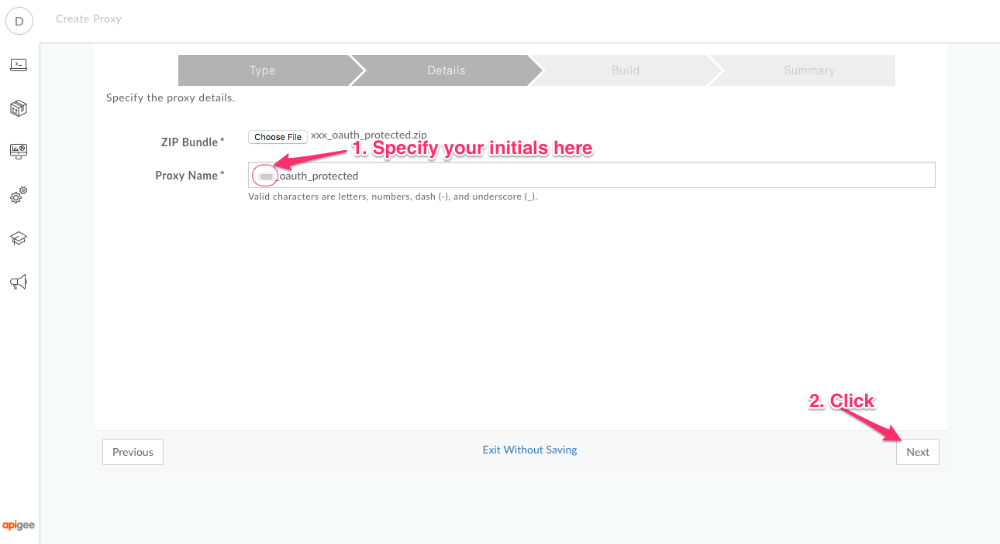
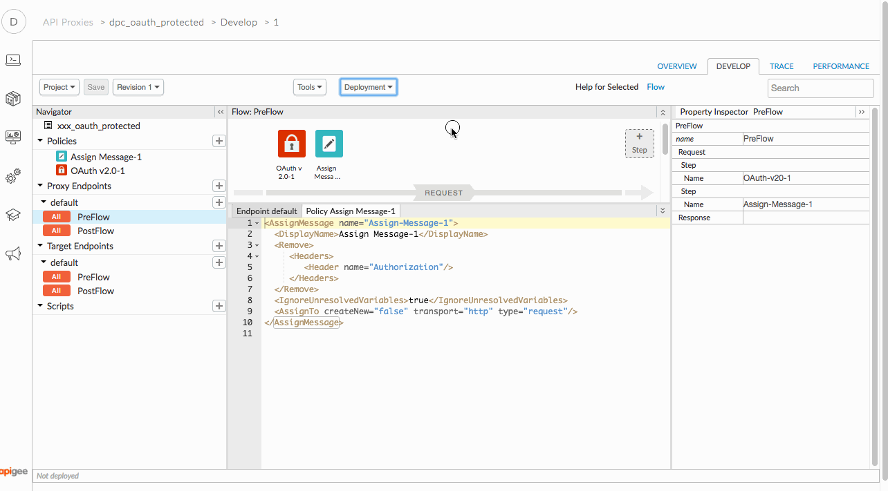

# Implementing OpenID Connect with Apigee Edge

*Duration : 30 mins*

*Persona : API Team/Security*

# Use case

You have a set of APIs that are consumed by trusted partners. You want to secure those APIs using a three legged OAuth (Authorization Code flow), using a standard OpenID Connect flow.

# Background

[OpenID Connect](http://openid.net/connect/) is a protocol that layers authentication on top of the OAuth 2.0 Authorization code flow, described in [RFC 6749](https://tools.ietf.org/html/rfc6749). Basically the user experience is very similar to what you would expect to see with a simple authorization code flow, but OpenID Connect standardizes a number of things around the flow, including:

* the use of nonces to prevent replay attacks
* the ability to deliver user information in a signed payload (JWT)
* Several well-defined scopes, including profile, email. Allowing the app to see this information about the user.
* ways to provide hints to the authentication experience - like a login hint or a display suggestion


Without OpenID Connect, apps that depend on OAuth2.0 tokens delivered via Authorization Code grants, and service providers that deliver tokens via Authorization Code grants, all work *similarly*, but not exactly the same. With OpenID Connect, there is a standard way for authentication to occur, a standard way to retrieve information about users. 

Standardization of these things means apps can be developed without regard for the token dispensary. It means better interoperability and lower effort in building apps.


# How can Apigee Edge help?

Apigee Edge can implement a full OpenID Connect protocol on top of any existing identity provider.
The result of an OpenID Connect can be an opaque OAuth token, which can be validated in the standard way with Apigee Edge. Optionally, an OpenID Connect flow can deliver a JWT to the app. Apigee Edge can also validate and verify that JWT.

Either way, Apigee Edge quickly lets you deliver tokens with OpenID Connect, and then secure your APIs using pre-built OAuth policies. 


# Background: What is the Authorization Code grant?

If you are not familiar with the Authorization Code grant in OAuth2.0, you should review the
[OAuth2.0 specification - RFC 6749](https://tools.ietf.org/html/rfc6749). 

OpenID Connect complements and extends that specification, on points dealing with the user authentication motion.  

The OpenID Connect protocol, because it lays right on top of Authorization Code
flow, follows the same sequence diagram as shown previously for Authorization
Code. The only difference is the data items that are passed back and forth.


# Pre-requisites

1. You have a login to Apigee Edge, and your organization includes the devjam oauth2-ac API proxy.  Your lab proctor can help with that, or you can deploy your own. See [the proxy bundle](../../../Resources/oauth2-oidc).

# Instructions

If you have completed the 2-legged OAuth exercise, then, you do not need
to create a different API Proxy, or API Product, or App. If you **have not** completed that
exercise, you must create those three things now. Do so, like this: 

## First, Create the API Proxy 

1. First, download [this zip file](./code/apiproxy_xxx_oauth_protected.zip) to your local machine, by clicking the link, and then clicking "Download". Then return here.

2. Go to [https://apigee.com/edge](https://apigee.com/edge) and be sure you are logged in.

3. Select **Develop → API Proxies** in the side navigation menu

   

4. Click **+ Proxy**. The Build a Proxy wizard is invoked.

   

5. Select **Proxy bundle**. Click on **Next**, and then choose the zip file that you just downloaded.

   

2. Specify the name for the new proxy, using your initials..., and click **Next**

   

2. Then click **Build**

   

2. Once the API proxy has been built, **click** the link to view your proxy in the proxy editor. 

2. You should see the proxy **Overview** screen. 

2. Click the **Develop** tab.

   

   This shows you the contents of the API Proxy definition. This is just a pass-through proxy. There are no logic steps on this proxy, yet. 

3. Select the Proxy name and Update the display name with your initials.

   

4. Select the Proxy Endpoint and update the basepath, similarly.

   

2. Select **PreFlow** from the sidebar under **Proxy Endpoints** section.

   

2. Click on **+Step**

   

2. In the resulting dialog, scroll down select **OAuth v2.0** from the Security section then click the **Add** button.

   

2. Click on the policy and in the code editor, paste the code given below:

   ```
   <OAuthV2 name="OAuth-v20-1">
      <DisplayName>OAuth v2.0-1</DisplayName>
      <ExternalAuthorization>false</ExternalAuthorization>
      <Operation>VerifyAccessToken</Operation>
      <GenerateResponse enabled="true"/>
   </OAuthV2>
   ```

   It should look like this: 

   

2. Because we want Apigee to not pass the token to the backend API, let's remove the Authorization header. To do so, again click on **+Step**.

2. In the dialog, select **Assign Message** policy from the Mediation section then click the **Add** button.

   

2. Click on the policy and in the code editor, paste the code give below

   ```
   <AssignMessage name="Assign-Message-1">
     <DisplayName>Assign Message-1</DisplayName>
     <Remove>
        <Headers>
           <Header name="Authorization"/>
        </Headers>
     </Remove>
     <IgnoreUnresolvedVariables>true</IgnoreUnresolvedVariables>
     <AssignTo createNew="false" transport="http" type="request"/>
   </AssignMessage>
   ```

   It should look like this:

   


2. Click the blue **Save** button to save the proxy.

2. *Congratulations!*...You’ve now successfully created an API in Apigee Edge that is protected with OAuth 2.0.

2. Use the Deployment dropdown to deploy it on the **test** environment.

   


## Second, Create the API Product

Once again, if you have completed the exercise for the OAuth 2-legged
flow, you do not have to complete this set of steps. 

1. In the Apigee UI, select **Publish → API Products** from the side navigation menu

   

2. Click **+API Product**

   

3. Populate the following fields

    * Section: Product Details

        * Name: **{your_initials}**_oauth_product

        * Environment: test

        * Access: Public

        * Allowed OAuth Scopes: A,B,C

    * Section: Resources

        * Section: API Proxies

            * Click the **+API Proxy** button
            
              

            * Select the API Proxy you just created.

4. Click the blue **Save** button on the bottom right corner of the page, to save the API Product.
  
  There is now a new, consumable unit of APIs available to external (consuming) developers. 


## Third, Create the App

Again, you need to do this only if you have not created an App for the
2-legged OAuth exercise.

1. Click **Publish → Apps** in the side navigation

   

2. Click **+App**

   

3. Populate the following fields

    * Name: **{your_initials}**-oauth-app

    * Developer: (choose any available developer)

    * Product: Click **+Product** to add your API Product to this App.

   

4. In the lower right corner, click the blue **Save** button.


## Get the client credentials

Now, obtain the consumer key and secret for the app, and encode them. 

1. In the apps list, select the app that you just created

2. Click on the show button under Consumer Key and Consumer Secret.

3. Copy the values and store them somewhere safe.


## Obtain a token

Now, we'll go through the 3-legged flow to obtain a token that
authenticates both the client app and the end user of the app.

1. In the Apigee UI, Navigate to Develop...Proxies...

2. Select the API Proxy called oauth2-oidc (or similar).

3. From the Proxy overview panel, copy the URL for your OAuth API proxy. 

   

   The url should end with oauth2, and oidc should appear in the path, prior.  

4. Click the Trace tab. Start a Trace session on the OAuth proxy. Later, you
   can view this session to see the message exchanges. 

5. Open a new browser tab to the [link builder](http://dinochiesa.github.io/openid-connect/link-builder2.html)

   This is a web form that helps you build a link for the OpenID Connect initiation.

6. Fill out the form with these values:

   * Edge org: **{your organization name}**
   * Edge env: **{your environment name}**, (probably `test`)
   * basepath: the basepath from the copied OIDC OAuth URL, above.
   * client_id: the client id you saved, previously
   * client_secret: the client secret you saved, previously
   * nonce: a nonce, a unique value per request
   * state: anything you like
   * callback URI: `https://dinochiesa.github.io/openid-connect/callback-handler.html`
   * response type: Select `id_token`
   * scope: Select `openid` `profile` and `email`

   When you have done this, the form should look something like this:

   

   You will notice as you fill out the form, a hyperlink appears at the bottom of the form.
   This link is constructed according to the rules for OpenID Connect.
   This web form is just a helper for a developer. An actual user would never see
   this experience. The URL generation would be embedded in the client app. 
   
7. When you have completed the form, right click the URL to open that location in a new tab.
   You should see a login form, that looks like this:

   

   This login screen is actually being served by an external website. In the normal
   case, the login-and-consent user experience is somethiing the API provider
   exposes. It will have branding that identifies the API provider, and will be a
   common experience that will apply to multiple, perhaps many, third party apps.
   Every time a user authorizes a new third-party app, they'll go through the same
   user login-and-consent experience.

8. Authenticate.  The username / password of dino@apigee.com / IloveAPIs should work.

9. You should then see a consent form. It notes the scopes that the app is asking for.
   Agree to give consent.

9. When that happens the web page will show a JWT, generated by Apigee Edge.
   It will look like this:

   

   This JWT identifies both the user and the client application.
   The client_id is contained in the aud property, and the user information
   is contained in other properties in the JWT.

9. You can now go back to the Apigee UI and examine the Trace session.
   Please note: if others are performing the same exercise, their transactions
   may be interspersed with yours in the same trace session. 


9. In a real app, the JWT can then be stored and used until it expires. 


# For Extra Credit

1. Go back to the Link Builder page and try different combinations of response_type and scope.


# For Discussion and Consideration

1. When used in production, should a JWT use HS256 algorithm or RS256?  Why? 

3. Why would you want to design a service to use opaque OAuth tokens, versus JWT? Why would OpenID Connect allow the generation of both at the same time? 


# Summary

In this lab you learned how Apigee Edge can be used to generate JWT via OpenID Connect. 

# References

* [Using OpenID Connect with Apigee Edge](https://community.apigee.com/articles/29258/using-apigee-edge-with-openid-connect.html)

