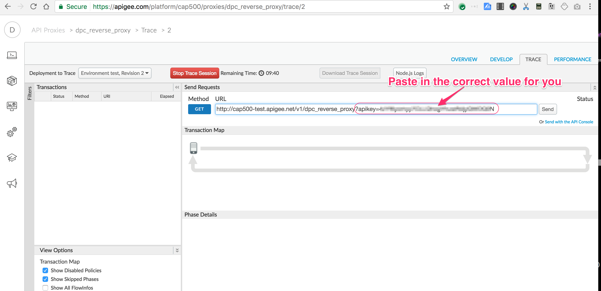

# Transformation : HTTP header injection

*Duration : 10 mins*

*Persona : API Team*

# Use case

You have an API Proxy that exposes a RESTful interface, and verifies the
security of the inbound request.  You want to communicate the
authenticated identity (client, or client and user) to the backend
system, via an HTTP Header.

# How can Apigee Edge help?

The [AssignMessage
Policy](http://docs.apigee.com/api-services/reference/assign-message-policy)
in Edge allows you to set additional headers into the southbound HTTP
message. This allows your backend to understand the identity
authenticated by Edge, or other data related to that request.

# Pre-requisites

For this exercise, you will need the API Proxy that you completed in the
exercise [*Securing APIs with API
Keys*](04-Securing-APIs-with-API-Keys).  The name of the proxy you created should be *XXX*_reverse_proxy, with the *xxx* replaced by your initials. If you do not have an API Proxy
available for this, revisit that prior exercise, and then return here to
complete these steps.

# Instructions

1. In a browser tab, navigate to [https://apigee.com/edge](https://apigee.com/edge) and be sure you are logged in.

5. Navigate to Publish....Apps.  Find the App you previously created and select it.
   If you do not have a previously created App, you should perform the
   exercise  [*Securing APIs with API Keys*](04-Securing-APIs-with-API-Keys). 

3. Click *Show* under *Consumer Key*.
   This will reveal the API Key that must be used to invoke the API when
   API Key verification is in use.  Copy this key into a text document for
   later use.

   


2. Now, select **Develop →API Proxies** in the side navigation menu. 

   

3. Select the *xxx*_reverse_proxy API.  You should see the overview panel.

4. Click the **Develop** tab.

   

   You will see the flow editor. 

8. Click the **Trace** tab near the top of the window.

   

6. Start a Trace session.

8. Use the Trace window to send a request. You will paste in the apikey (consumer ID) that you copied in the prior step.

   

9. Click Send (to the right of the address box)
   You should see a 200 OK response. 

9. Select the icon corresponding to the Verify API Key policy, and scroll the lower
   panel to see the context variables that are set by this policy.

   

   Two of the interesting variables are `developer.email` and `developer.app.name`
   
9. Stop the Trace session.

9. Flip back to the **Develop** tab.

9. Click **+ Step**

   

9. Scroll down about 70% and select the **Assign Message** policy.
   Click **Add**.

9. Replace the XML configuration in the lower pane with this value:

   ```
   <AssignMessage name="Assign-Message-1">
       <Set>
           <Headers>
               <Header name="developer-app">{developer.app.name}</Header>
               <Header name="developer-email">{developer.email}</Header>
           </Headers>
       </Set>
       <AssignTo createNew="false" transport="http" type="request"/>
   </AssignMessage>
   ```

   The result should look like this: 
   

   What this policy is doing is setting additional HTTP headers in the request
   that will be sent to the backend. 

9. Click **Save**

9. Click the **Trace** tab

9. Start a new Trace Session.

9. Again send a request. Remember to paste in the appropriate
   apikey query parameter, as before. (It should still be present in the form)

9. When the transaction appears, select it, and click the dot after the request
   icons.

   

   You should be able to scroll down and see the HTTP headers that will be sent
   to the backend system.

9. When you're finished sending requests, click "Stop Trace Session"


# For Extra Credit

See if you can conditionally add a Header, depending upon a query parameter.
Hint: you will need to wrap the AssignMessage policy in a Condition element.


# For Discussion and Consideration

1. Would it be possible for Apigee Edge proxy to receive a GET request and proxy it as a POST?  If so, how would this be done?

2. What other things could you do to an inbound request before proxying it to a backend API? 

# Summary

You’ve learned how to inject headers in an Apigee Edge API Proxy. 
# References

* Link to Apigee docs page

    * [Assign Message](http://docs.apigee.com/api-services/reference/assign-message-policy) Policy

    * [Conditions](http://docs.apigee.com/api-services/reference/conditions-reference) in Apigee

* Apigee Rest Client

    * [https://apigee-rest-client.appspot.com/](https://apigee-rest-client.appspot.com/)


