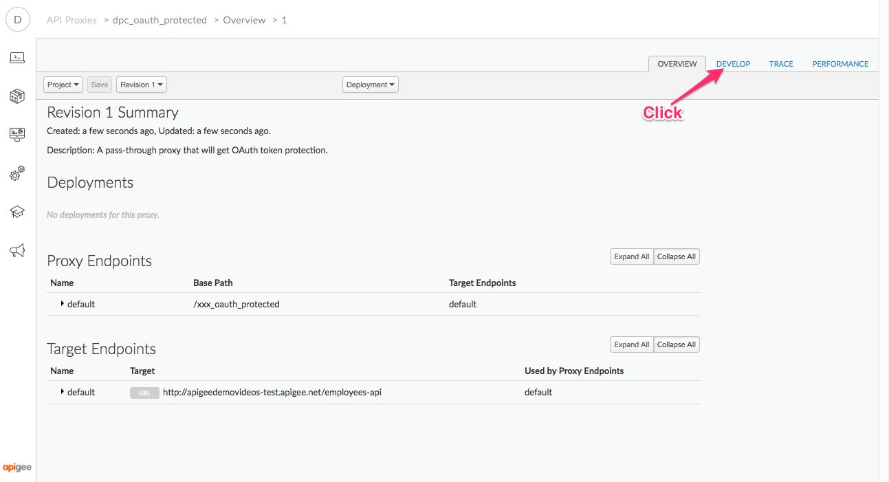

# Verifying 3rd Party JWT

*Duration : 20 mins*

*Persona : API Team/Security*

# Use case

You would like to build an API Proxy that will verify a JWT generated by a 3rd party. For example, you would like to implement [RFC 7523](https://tools.ietf.org/html/rfc7523), which describes how to exchange a JWT for an opaque OAuth token. 

# Background

[JWT is described in IETF RFC 7519](https://tools.ietf.org/html/rfc7519). It is a standardized approach to signing a payload, represented as JSON. Any application can produce or verify the signature on a signed JWT. 

JWT is being used by many systems, including Google APIs, Azure Active Directory, Ping, Salesforce, and many others. 

# How can Apigee Edge help?

You can easily configure Apigee Edge to verify a JWT produced by any third party, whether the signing algorithm is HS-256 (shared secret) or RS-256 (public/private key).

Because Apigee Edge can verify JWT, you can construct your API Proxies to authorize inbound requests based on federated identity. 


# Pre-requisites

1. You should be familiar with JWT. You may wish to [read the specification](https://tools.ietf.org/html/rfc7519).

# Instructions

## Part 1: Build your own JWT

1. Open a browser tab to [this online
   tool](http://jwtbuilder.jamiekurtz.com/). This tool allows you to
   construct your own JWT, interatively. You can specify the claims, the signing algorithm,
   and even the key. 

2. Specify these values:

   * Issuer : `Online JWT Builder`
   * Audience : `https://apigee.com`
   * Subject : `https://cloud.google.com/apigee-api-management`

   It should look like this: 
   

   The issuer is the party that is issuing the JWT. The audience is an identifier of
   the intended reader. The subject is the party to which the claims in the jwt
   apply. These are well-known (standard) "claims" in a JWT.  In a JWT, these can be
   anything. The verifier of a JWT can verify these claims

3. Scroll down in the tool, and specify the encryption algorithm as HS256.
   Specify this for the key: `0123456789012345678901234567890123`

   It's not absolutely imperative that the key be this exact value, but the key
   needs to be at least 256 bits of data, for HS-256 signature. Whatever you use,
   you must remember the value.

3. Click "Create Signed JWT"
  
3. Observe the output.  It should look something like this:

   ```
   eyJhbGciOiJIUzI1NiIsInR5cCI6IkpXVCJ9.eyJpc3MiOiJodHRwczovL2p3dC1pZHAuZXhhbXB
   sZS5jb20iLCJzdWIiOiJtYWlsdG86bWlrZUBleGFtcGxlLmNvbSIsIm5iZiI6MTQ5MTM2NTQ3OSw
   iZXhwIjoxNDkxMzY5MDc5LCJpYXQiOjE0OTEzNjU0NzksImp0aSI6ImlkMTIzNDU2IiwidHlwIjo
   iaHR0cHM6Ly9leGFtcGxlLmNvbS9yZWdpc3RlciJ9.NdVinpulEbiCXHGCU1mxwAD05v7q6ei2K3
   i9CbmEae0
   ```

   Every signed JWT has three segments, each base64-encoded, then joined with dots. To parse a
   JWT, an application needs to split it, then base64-decode the parts. The three parts are

   * header
   * payload
   * signature

   After base64-decoding, the first two elements are JSON-formatted. The last is a
   digital signature, so base64-decoding it produces an series of octets.

   Verifying a JWT means verifying that the signature octets are valid and
   correspond to the payload. 


## Part 2: Import the JWT verification Proxy

1. Download [this zip file](./code/apiproxy_xxx_jwt_verification.zip) to your local machine, by clicking the link, and then clicking "Download". Then return here.

2. Navigate to [https://apigee.com/edge](https://apigee.com/edge) and be sure you are logged in.

3. Select **Develop → API Proxies** in the side navigation menu

   

4. Click **+ Proxy**. The Build a Proxy wizard is invoked.

   

5. Select **Proxy bundle**. Click on **Next**, and then choose the zip file that you just downloaded.

   

2. Specify the name for the new proxy, using your initials.... The name should be *xxx*_jwt_verification.  Click **Next**

   

2. Then click **Build**

   

2. Once the API proxy has been built, **click** the link to view your proxy in the proxy editor. 

2. You should see the proxy **Overview** screen. 

2. Click the **Develop** tab.

   

   This shows you the contents of the API Proxy definition. This proxy has been pre-built to verify JWT.


3. Select the Proxy name and Update the display name with your initials.

   

4. Select the Proxy Endpoint and update the basepath, similarly.

   

5. Click the blue **Save** button to save the proxy.

2. Use the Deployment dropdown to deploy the proxy on the **test** environment.

   

3. Select the **Overview** Tab.  Copy the URL for the JWT verification Proxy. 

4. Open a browser tab to the [Apigee REST Client](https://apigee-rest-client.appspot.com/)
   Specify these settings:

   * url: the URL of the JWT verification proxy.  Append the string `/t1` to the path.
   * verb: `POST`
   * Body parameters:
      * `jwt`: the signed, encoded JWT from the online JWT generator tool (switch tabs to copy/paste)
      * `key` : `0123456789012345678901234567890123`

5. Click **Send**

   You should see a successful response.
   Apigee Edge is verifying the JWT that you generated externally. 

5. Modify the key parameter to be something different.  Again, click **Send**

   You should see a 401 response.
   Apigee Edge is correctly telling you that the JWT could not be verified with that key.


# For Extra Credit

1. Use the online JWT generator tool to generate different JWT with different claims. Try them out.

2. Obtain a JWT from some other source, and modify the API Proxy in Apigee Edge so that it will verify that JWT.  This may require using a different algorithm (RS256) and key.


# For Discussion and Consideration

1. In this exercise, the client (Apigee REST client) sent in the shared key that Edge used to decrypt the JWT.  Does it make sense for a client to send in the  shared key to decrypt a JWT? Why or why not?

2. Could Apigee Edge validate a JWT generated earlier by Apigee Edge?


# Summary

In this lab you learned how Apigee Edge can be used to validate JWT that are generated externally. 


