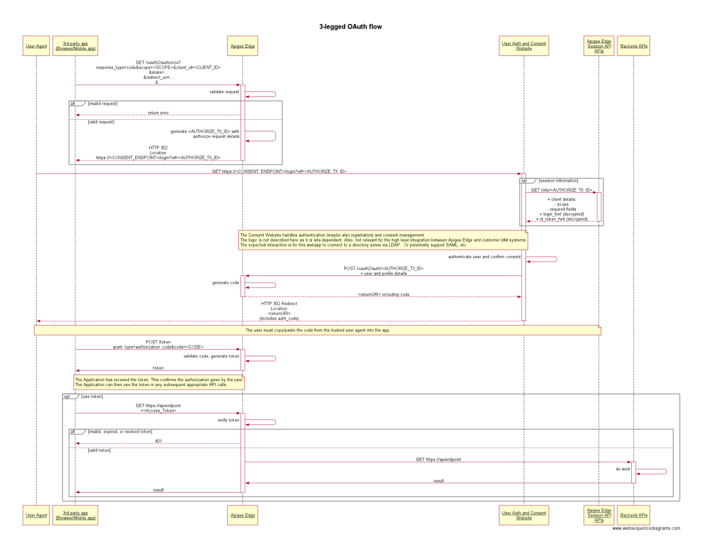

# OAuth 3-legged Proxy

This is an API Proxy that implements the OAuth2.0 3-legged (authorization code) flow.
The login-and-consent app is bundled with the API Proxy.
This makes it super easy to demonstrate 3-legged OAuth in Apigee.
This works with Apigee Edge, X, or hybrid.

# Background: What are the Three Legs?

The "three legs" in the name refer to the User Identity Server, the resource (API) server, and the client app itself. These are three pieces of software that are involved in an exchange.

The idea is that the user will authenticate to the Identity Server. The client will authenticate itself with the resource (API) server, which will generate a token and provide it to the app, on behalf of the user. In this way the user never directly provides credentials to the client application. The theory is the user can then control which apps have access to various resources on his or her behalf.

The flow looks like this:




In a 3-legged flow, Apigee acts as the OAuth authorization server. Its role
is to generate access tokens, validate access tokens, and proxy authorized
requests for protected resources on to the resource server. Apigee
delegates user authentication to the Identity Provider.


## Setup

If you are using this proxy as part of an Apigee-led hands-on workshop, the
proxy has already been deployed for you, and you probably don't need to perform
this setup.  If you are using this proxy on your own, you will need to perform
the following setup steps.

### Deploy the User Authentication Web UI

OLD: The login and consent experience is [here](./appengine).

To demonstrate Authorization Code or OpenID Connect logins,
the login experience needs to be available "in the cloud".

### Set up the API Proxy Using the Script

```
cd tools
npm install
ORG=my-apigee-organization
ENV=test-env

# for Apigee Edge
node ./provision -v -u apigeeadmin@example.org -o $ORG -e $ENV

# for Apigee X or hybrid
TOKEN=$(gcloud auth print-access-token)
node ./provision -v --token $TOKEN --apigeex -o $ORG -e $ENV
```

The output of the provision script will display the client\_id and
client\_secret.
```
ORG=my-apigee-org
ENV=test1
client_id=LInxm05djhdieoelksp02092
client_secret=e0oLV3vzdNAX34duG5aukd9rr0llkskawo
```

You should copy/paste those statements in the terminal to set
shell variables.
```
$ client_id=LInxm05djhdieoelksp02092
$ client_secret=e0oLV3vzdNAX34duG5aukd9rr0llkskawo
```

You will need these later.


### Manually setting up the API Proxy

Alternatively, you can perform all the steps the script performs, manually.

1. Using the Apigee Administrative UI, create the cache called "cache1" in the environment in which you will deploy the proxy.

2. Deploy the API Proxy. You can use the UI, or a command-line tool.

3. Again, using the Apigee Admin UI, Create the following assets:

   - an API Product. It should have scopes: A,B,C
   - a developer
   - a developer app. The app should have a redirect URI of https://dinochiesa.github.io/openid-connect/callback-handler.html .


Whether you use the provision script or configure things manually,
you need to note the  `client_id` and `client_secret` (consumer key and consumer secret) of the developer app.


## To Kick off the flow:

To kick off, you need to open a link in your browser. For Apigee Edge, paste the following into your browser address bar:

```
https://$ORG-$ENV.apigee.net/devjam3/oauth2-ac/authorize?client_id=CLIENT_ID_HERE&redirect_uri=https://dinochiesa.github.io/openid-connect/callback-handler.html&response_type=code&scope=A
```

For Apigee X or hybrid, the url is basically the same, except you should replace the domain with your own API endpoint.

```
https://my-api-endpoint.net/devjam3/oauth2-ac/authorize?client_id=CLIENT_ID_HERE&redirect_uri=https://dinochiesa.github.io/openid-connect/callback-handler.html&response_type=code&scope=A

```

This will redirect you to a URL for the login-and-consent app.  You will need to authenticate.

The login-and-consent app uses a mock user database, and these are the valid username / password pairs:
* dino@apigee.com / IloveAPIs
* valerie@example.com / Wizard123
* heidi@example.com / 1Performance
* greg@example.com / Memento4Quiet
* naimish@example.com / Imagine4


Once you authenticate and grant consent, you will receive a code via the redirect_uri.
The redirect_uri you pass should be able to display a code. The one shown above works just fine for most purposes.


## To exchange the code for a token

Copy the code shown in the redirect_uri web page, then paste it into the body in place of `CODE_HERE` like so:

```
# for Apigee Edge
endpoint=https://$ORG-$ENV.apigee.net

# for Apigee X or hybrid
endpoint=https://my-api-endpoint.net

curl -i -u $client_id:$client_secret \
  -X POST "$endpoint/devjam3/oauth2-ac/token" \
  -d 'grant_type=authorization_code&code=CODE_HERE&redirect_uri=https://dinochiesa.github.io/openid-connect/callback-handler.html'
```
Note: you must also replace the client_id and client_secret in the above.


## To refresh the token:

Copy the refresh token that you receive from the above, into the following in place of VALUE_HERE:

```
curl -i -u client_id:client_secret \
   -X POST "$endpoint/devjam3/oauth2-ac/token" \
   -d 'grant_type=refresh_token&refresh_token=VALUE_HERE'

```

## Web form help

You can also use [this web form](https://dinochiesa.github.io/openid-connect/link-builder3.html) to guide you through constructing the kickoff URL, and redeeming the code for a token.


## Teardown

If you are using this proxy as part of an Apigee-led hands-on workshop, leave the proxy and the assets.
If you are using this proxy on your own, you may want to tear down (remove) all the configuration.

To do so:

```
cd tools
npm install

# for Apigee Edge
node ./provision -v -u apigeeadmin@example.org -o $ORG -e $ENV -R

# for Apigee X or hybrid
TOKEN=$(gcloud auth print-access-token)
node ./provision -v --token $TOKEN --apigeex -o $ORG -e $ENV -R
```
